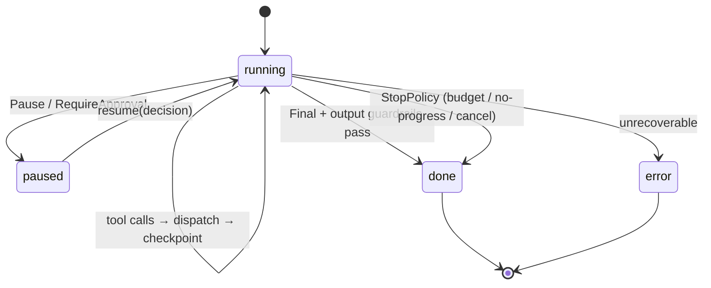

# 02 — Agent Loop & Runtime

> The engine that interprets an `Agent`. Part of OpenMate; see [architecture.md §6](architecture.md#6-the-agent-loop). Depends on [01](01-domain-model-and-kernel.md); hosts the hooks every other module plugs into.

## Scope & responsibilities

The `Runtime` turns a declarative `Agent` + input into a `RunResult` by driving the **agent loop**: assemble context → decide (model) → act (tools) or finish → checkpoint → check stop. It owns step sequencing, the **interceptor chain** (cross-cutting middleware), termination control, streaming, and pause/resume. It owns *mechanism*; all *policy* (how to plan, what to retrieve, when to block) is injected (architecture P3).

The runtime is the integration point: planning ([05](05-planning-and-reasoning.md)) plugs in as a `ReasoningStrategy`, safety ([10](10-safety-and-guardrails.md)) as guardrail interceptors, context ([09](09-context-engineering.md)) as a `ContextPolicy`, persistence ([06](06-memory-and-state.md)/[12](12-production-and-reliability.md)) as the checkpoint interceptor.

---

## Core abstractions (class level)

```python
# openmate/kernel/runtime.py
class Runtime:
    def __init__(self, svc: Services, interceptors: list["StepInterceptor"] | None = None):
        self.svc = svc
        self.chain = interceptors or default_chain()
        self.executor = ToolExecutor(svc)

    async def run(self, agent: Agent, input: Input, *, thread_id: str | None = None) -> RunResult: ...
    def stream(self, agent: Agent, input: Input, *, thread_id=None) -> AsyncIterator[Event]: ...
    async def resume(self, thread_id: str, decision: "HumanDecision | None" = None) -> RunResult: ...
    async def cancel(self, thread_id: str) -> None: ...

# the unit a strategy returns each step
StepOutcome = Union["ToolCalls", "Final", "Subgoal", "Handoff", "Pause"]
@dataclass class ToolCalls: calls: list[ToolCallPart]
@dataclass class Final:     message: Message
@dataclass class Subgoal:   task: "Task"                 # used by planners/orchestration
@dataclass class Handoff:   to: Agent; reason: str
@dataclass class Pause:     reason: str; payload: dict   # HITL / external wait

# middleware over a single step
@dataclass
class StepContext:
    agent: Agent; state: RunState; svc: Services; window: list[Message] | None = None
class StepInterceptor(Protocol):
    async def __call__(self, ctx: StepContext, nxt: Callable[[StepContext], Awaitable[StepResult]]) -> StepResult: ...
```

---

## Phase 0 — PoC (foundational)

**Goal:** a correct, readable async ReAct loop with a hard step cap. No interceptors, no resume — just the spine.

```python
async def run(self, agent, input, *, thread_id=None):
    state = RunState(thread_id or self.svc.new_id(), [sys(agent), user(input)])
    self.svc.bus.emit(RunStarted(...))
    while state.status == "running" and state.step < agent.max_steps:
        window = [*state.messages]                                  # PoC: whole transcript
        resp = await self.svc.model.generate(window, tools=specs(agent.tools))
        state = state.with_messages(resp.message)
        calls = [p for p in resp.message.content if isinstance(p, ToolCallPart)]
        if not calls:
            state = state.finish(resp.message); break
        results = await self.executor.dispatch(calls, agent, self.svc)  # sequential ok in PoC
        state = state.with_messages(Message("tool", results)).advance()
    self.svc.bus.emit(RunFinished(...))
    return state.to_result()
```

**PoC acceptance:** multi-step tool use terminates on a final answer or the step cap; every step emits events; `FakeModel` makes it deterministic.

---

## Phase 1 — Interceptor chain (middleware)

Refactor the loop body into an ordered chain so cross-cutting concerns compose without editing `run` (architecture §6.2). Each interceptor wraps the next and may short-circuit.

```python
def default_chain() -> list[StepInterceptor]:
    return [TracingInterceptor(), BudgetInterceptor(), InputGuardrailInterceptor(),
            ContextInterceptor(), ReasoningInterceptor(), ToolAuthInterceptor(),
            ToolExecInterceptor(), OutputGuardrailInterceptor(), CheckpointInterceptor()]
```

- `ReasoningInterceptor` calls `agent.planner.step(...)` (default `ReAct`) and is the only one that *must* be present.
- `ContextInterceptor` populates `ctx.window` from the `ContextPolicy` ([09](09-context-engineering.md)).
- Others are no-ops until their owning module ships, so the chain grows with the system.

Add **streaming**: `stream()` yields from the bus while `run()` executes, enabling token-level UIs. Implemented with an `asyncio.Queue` the bus writes to.

---

## Phase 2 — Termination & loop control

Replace `max_steps` with a composable `StopPolicy` evaluated every step (architecture §6.3). Stopping correctly is as important as acting.

```python
class StopPolicy(Protocol):
    def evaluate(self, state: RunState, svc: Services) -> StopDecision: ...   # Continue | Stop(reason)

class CompositeStop(StopPolicy):            # OR of children; first to stop wins
    def __init__(self, *policies: StopPolicy): ...

# concrete policies (techniques)
class MaxSteps(StopPolicy):        ...      # step ceiling
class Budget(StopPolicy):          ...      # tokens / dollars / wall-clock
class NoProgress(StopPolicy):      ...      # detect repeated/oscillating tool calls (loop guard)
class GoalReached(StopPolicy):     ...      # a verifier confirms success (ties to reflection, 05)
class Cancelled(StopPolicy):       ...      # external cancel flag in store
```

`NoProgress` (the **loop guard**) hashes recent (tool, args) tuples and stops on cycles or N identical calls — the single most useful safeguard against runaway agents. On any non-natural stop, return a `RunResult(status, reason)` with the last good checkpoint intact.

---

## Phase 3 — Durability, pause/resume & HITL

Make runs survive crashes and human gates. Because `RunState` is a full checkpoint ([01](01-domain-model-and-kernel.md)) and tools record a `cursor`, the loop is resumable.

- **Checkpoint interceptor** saves `RunState` after each step via `Store` ([06](06-memory-and-state.md)). On startup, `resume(thread_id)` loads the last checkpoint and re-enters the loop.
- **Pause/resume:** a `Pause` outcome (or a guardrail `RequireApproval`) writes a `cursor` describing the awaited decision, persists, and returns `status="paused"`. `resume(thread_id, decision)` injects the human's choice and continues. This is the substrate for HITL ([10](10-safety-and-guardrails.md)).

```python
@dataclass class HumanDecision: action: Literal["approve","reject","edit"]; edited_args: dict | None = None
```

- **Idempotent resume:** before re-executing a tool, the executor checks the `cursor`/idempotency key so a crash between "tool ran" and "state saved" doesn't double-execute (full treatment in [12](12-production-and-reliability.md)).
- **Cancellation:** `cancel()` sets a flag the `Cancelled` stop policy observes; in-flight tool calls receive a cancellation signal via `RunContext.deadline`.

---

## Phase 4 — Concurrency & advanced execution

- **Parallel tool dispatch** within a step: independent `ToolCallPart`s run concurrently (`asyncio.gather`) with a concurrency limit; results re-ordered deterministically by `call.id` ([04](04-tools-and-mcp.md)).
- **Speculative execution:** while awaiting a slow tool, optionally pre-assemble the next context or prefetch likely retrievals; discard if invalidated. Off by default (cost vs. latency).
- **Sub-runs / isolation:** the runtime can spawn a child `run()` with its own clean `RunState` for a sub-agent ([08](08-multi-agent-orchestration.md)), keeping the parent window lean ([09](09-context-engineering.md)).
- **Batched stepping:** for eval/offline workloads, run many threads cooperatively on one event loop for throughput ([11](11-observability-and-evaluation.md)).

---

## Control-flow summary



## Testing & verification

- **Determinism:** identical event log across two runs with the same seed + `FakeModel`.
- **Crash/resume:** kill after step k, `resume`, assert final state equals the uninterrupted run (and no tool double-executed).
- **Loop guard:** an adversarial `FakeModel` that repeats a call must be stopped by `NoProgress`.
- **Interceptor isolation:** each interceptor unit-tested with a stub `nxt`.

## Trade-offs & open questions

Synchronous vs. async-only API (decision: async core, thin sync wrapper). How much logic belongs in interceptors vs. the loop (keep the loop ≤ ~40 lines). Whether speculative execution earns its complexity (defer until profiled).
