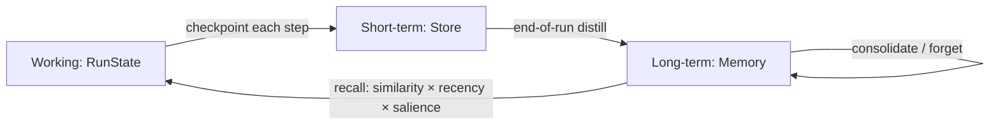

# 06 — Memory & State

> Three time-scales of memory + the durability substrate. Part of OpenMate; see [architecture.md §9](architecture.md#9-memory--state). Backs both conversation persistence and checkpoints (they're the same `RunState`).

## Scope & responsibilities

OpenMate separates **working memory** (this run — `RunState` itself), **short-term memory** (this thread — persisted history + summaries), and **long-term memory** (cross-thread — episodic, semantic, procedural). Conflating them is a common bug. This module owns the `Store` port (state/checkpoint persistence) and the `Memory` port (long-term recall/write), plus the policies governing what gets promoted and when. Window-fitting of working memory is delegated to context engineering ([09](09-context-engineering.md)); embeddings come from [03](03-model-port-and-providers.md).

---

## Core abstractions (class level)

```python
# openmate/ports/store.py  — short-term + checkpoints
class Store(Protocol):
    async def load(self, thread_id: str) -> RunState | None: ...
    async def save(self, thread_id: str, state: RunState) -> int: ...    # returns rev
    async def history(self, thread_id: str) -> list["Checkpoint"]: ...    # time-travel
    async def append_events(self, thread_id: str, evs: list[Event]) -> None: ...

# openmate/ports/memory.py  — long-term
@dataclass
class MemoryItem:
    id: str; kind: Literal["episodic","semantic","procedural"]
    content: str; embedding: Vector | None = None
    metadata: dict = field(default_factory=dict); ts: float = 0.0
    salience: float = 0.0; ttl_s: float | None = None

@dataclass
class MemoryQuery:
    text: str | None = None; kind: str | None = None
    k: int = 5; filters: dict | None = None; recency_halflife_s: float | None = None

class Memory(Protocol):
    async def recall(self, q: MemoryQuery, ctx: RunContext) -> list[MemoryItem]: ...
    async def remember(self, items: list[MemoryItem], ctx: RunContext) -> None: ...
    async def forget(self, selector: "MemorySelector", ctx: RunContext) -> None: ...
```

---

## Phase 0 — PoC (foundational)

**Goal:** durable threads + the simplest useful long-term memory.

- `InMemoryStore` (tests) and `SQLiteStore` (local default): `save`/`load` a JSON-serialized `RunState` keyed by `thread_id`, with a `rev` column. This alone gives resumable conversations ([02](02-agent-loop-and-runtime.md) Phase 3).
- `KeyValueMemory`: long-term facts as explicit key→value the agent reads/writes via a `memory.get`/`memory.set` **tool** ([04](04-tools-and-mcp.md)). Legible, auditable, no embeddings needed yet.

```python
class SQLiteStore(Store):
    async def save(self, thread_id, state):
        blob = codec.to_jsonable(state); rev = state.rev
        await self._db.execute("INSERT INTO checkpoints(thread,rev,blob,ts) VALUES(?,?,?,?)", ...)
        return rev
    async def load(self, thread_id):
        row = await self._db.fetchone("SELECT blob FROM checkpoints WHERE thread=? ORDER BY rev DESC LIMIT 1", ...)
        return codec.from_jsonable(row.blob) if row else None
```

**PoC acceptance:** a conversation survives process restart via `load`; the agent stores and later recalls a fact through the memory tool.

---

## Phase 1 — Semantic long-term memory

- **Vector-backed recall:** `VectorMemory` over a vector store ([07](07-retrieval-rag.md) shares the backend). `remember` embeds and upserts; `recall` does semantic search with metadata filters.
- **Hybrid scoring:** rank by `similarity × recency_decay × salience` so fresh, important memories surface (not just the most cosine-similar).
- **Two access modes** (offer both, same port): explicit **memory-as-tool** (model decides when to recall/write) and **automatic recall** via a `MemoryRecallInterceptor` that injects relevant items into context each turn ([09](09-context-engineering.md)).

---

## Phase 2 — Memory types & write policies

Model the three long-term kinds distinctly:

- **Episodic** — what happened (past run summaries, events). Written at end-of-run by distillation.
- **Semantic** — durable facts, user profile, preferences. Written on explicit instruction or salience.
- **Procedural** — reusable how-tos / successful plans (ties to [05](05-planning-and-reasoning.md) plan caching).

**Write policy** is itself pluggable (avoid memory pollution):

```python
class WritePolicy(Protocol):
    async def select(self, state: RunState, svc: Services) -> list[MemoryItem]: ...
class OnInstruction(WritePolicy): ...    # only when user/agent says "remember"
class OnSummary(WritePolicy): ...        # distill salient facts at run end
class OnSalience(WritePolicy): ...       # a small model flags durable facts
```

Default = `OnInstruction` + `OnSummary`. **Never** persist sensitive PII to long-term stores without an explicit flag ([10](10-safety-and-guardrails.md); [01](01-domain-model-and-kernel.md) sensitivity tags).

---

## Phase 3 — Memory lifecycle & advanced techniques

- **Consolidation / summarization:** periodically merge many episodic items into higher-level semantic memories (sleep-time compaction); dedupe near-duplicates.
- **Forgetting:** TTL expiry, salience decay, and explicit `forget` (right-to-be-forgotten); contradiction resolution when a new fact supersedes an old one (versioned facts).
- **Reflection memory:** persist lessons from failed attempts ([05](05-planning-and-reasoning.md) Reflexion) so the agent improves across runs.
- **Graph memory:** entities + relations for multi-hop recall ("who reports to whom") — overlaps GraphRAG ([07](07-retrieval-rag.md)).
- **Memory offloading:** keep pointers in-context, payloads in the store; pull on demand ([09](09-context-engineering.md)).
- **Scoping & isolation:** per-user / per-agent / shared namespaces; sub-agents get isolated memory unless explicitly shared ([08](08-multi-agent-orchestration.md)).

---

## Phase 4 — Production state stores & durability

- **Backends:** `PostgresStore` (durable, queryable, `pgvector` for memory) and `RedisStore` (low-latency, TTL-native). Same `Store`/`Memory` ports; swap by config.
- **Time-travel & forking:** `history()` enables replay-to-checkpoint and branching a run from any past state ([11](11-observability-and-evaluation.md)).
- **Concurrency:** optimistic concurrency on `rev` (compare-and-swap) so two workers can't clobber a thread; reducers ([01](01-domain-model-and-kernel.md)) merge legitimate concurrent updates.
- **Event log vs. snapshot:** store periodic snapshots + the event tail for cheap, exact reconstruction (event sourcing, [01](01-domain-model-and-kernel.md) Phase 2).



## Testing & verification

- **Durability:** save → restart → load yields an identical run; CAS rejects stale writes.
- **Recall quality:** a memory eval set measures recall@k and that recency/salience weighting beats raw cosine.
- **Pollution guard:** write policies don't persist transient chit-chat; PII flag blocks long-term writes.
- **Forgetting:** TTL/forget removes items from recall; superseded facts don't resurface.

## Trade-offs & open questions

Memory-as-tool vs. automatic injection (offer both; default tool for auditability). How much to summarize vs. keep verbatim (lossy recall risk). One vector backend shared with RAG vs. separate stores (share for PoC). Salience scoring cost vs. benefit. Graph memory complexity — defer unless multi-hop recall is needed.
