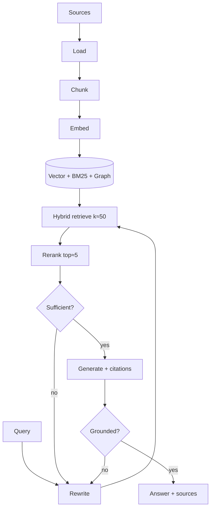

# 07 — Retrieval (RAG)

> Grounding the agent in external knowledge. Part of OpenMate; see [architecture.md §10](architecture.md#10-retrieval-rag). RAG is a **spectrum** of composable pieces, from one retrieval call to retrieval-as-a-tool the agent drives itself.

## Scope & responsibilities

This module owns ingestion (load → chunk → embed → index), the `Retriever` port and its variants (dense, sparse, hybrid, reranked, graph, multimodal), grounded generation with citations, and RAG evaluation. It reuses the embeddings port and routing from [03](03-model-port-and-providers.md), shares the vector backend with memory ([06](06-memory-and-state.md)), and exposes retrieval to agents as a `Tool` ([04](04-tools-and-mcp.md)) for agentic RAG. Grounding checks tie into output guardrails ([10](10-safety-and-guardrails.md)).

---

## Core abstractions (class level)

```python
# openmate/ports/retriever.py
@dataclass
class Document:
    id: str; text: str; metadata: dict
    score: float = 0.0; embedding: Vector | None = None

class Retriever(Protocol):
    async def retrieve(self, query: str, *, k: int, filters: dict | None = None) -> list[Document]: ...

class Indexer(Protocol):
    async def ingest(self, docs: Iterable["RawDoc"]) -> "IngestReport": ...

# pluggable ingestion stages
class Loader(Protocol):   async def load(self, src) -> Iterable["RawDoc"]: ...
class Chunker(Protocol):  def split(self, doc: "RawDoc") -> list["Chunk"]: ...
class Embedder(Protocol): async def embed(self, texts: list[str]) -> list[Vector]: ...   # from 03
class VectorStore(Protocol):
    async def upsert(self, items: list["VectorRecord"]) -> None: ...
    async def query(self, vec: Vector, *, k: int, filters=None) -> list[Document]: ...
```

---

## Phase 0 — PoC (foundational): naive RAG

**Goal:** ingest documents and answer questions grounded in them — the simplest end-to-end pipeline.

```python
# ingest: load → fixed-size chunk → embed → upsert
class NaivePipeline:
    async def ingest(self, src):
        for doc in self.loader.load(src):
            chunks = self.chunker.split(doc)                 # PoC: fixed window + overlap
            vecs = await self.embedder.embed([c.text for c in chunks])
            await self.store.upsert(zip(chunks, vecs))
# retrieve + generate
class DenseRetriever(Retriever):
    async def retrieve(self, query, *, k, filters=None):
        v = (await self.embedder.embed([query]))[0]
        return await self.store.query(v, k=k, filters=filters)
```

Ship one `VectorStore` adapter (Chroma or `sqlite-vec` for zero-infra PoC) and a `RetrieveTool` wrapper so an agent can call retrieval. Generation just stuffs top-k into context with a "answer from these sources" instruction.

**PoC acceptance:** ask a question; the agent retrieves relevant chunks and answers from them; irrelevant questions return "not found in sources."

---

## Phase 1 — Hybrid retrieval + reranking (the quality default)

The single highest-leverage upgrade — fixes most retrieval failures.

```python
class HybridRetriever(Retriever):
    def __init__(self, dense: Retriever, sparse: Retriever, fusion="rrf"): ...
    async def retrieve(self, query, *, k, filters=None):
        d, s = await gather(self.dense.retrieve(query,k=50), self.sparse.retrieve(query,k=50))
        return reciprocal_rank_fusion(d, s)[:k]              # combine dense + BM25

class Reranker(Protocol):
    async def rerank(self, query: str, docs: list[Document], top_n: int) -> list[Document]: ...
class CrossEncoderReranker(Reranker): ...                    # retrieve top-50 → rerank top-5
```

Pipeline: **query rewrite/expansion** → **hybrid (dense + BM25)** → **rerank (cross-encoder)** → generate. Add **metadata filtering** (date, source, ACL) and **chunk-then-expand** (retrieve small, return surrounding context).

---

## Phase 2 — Agentic & corrective RAG

Make retrieval a decision the agent controls.

- **Agentic RAG:** retrieval is a `Tool` the agent calls — possibly many times, across multiple retrievers — judging results and re-querying when insufficient. This is *just an OpenMate agent* ([02](02-agent-loop-and-runtime.md)) whose tools are retrievers; no special engine. Right for hard, multi-hop questions where latency is acceptable.
- **Corrective / Self-RAG:** a grader critiques retrieved evidence; if weak/missing, trigger another pass or a web fallback before generating. Implemented as reflection ([05](05-planning-and-reasoning.md)) applied to retrieval.

```python
class AgenticRAG:                              # composed, not a new primitive
    tools = [RetrieveTool(vector), RetrieveTool(web), GradeEvidenceTool()]
    # the agent loops: retrieve → grade → (re-query | answer with citations)
```

- **Query planning:** decompose a complex question into sub-queries, retrieve per sub-query, then synthesize (multi-hop).

---

## Phase 3 — Advanced indexing & retrieval

As many techniques as the corpus warrants:

- **GraphRAG:** build an entity/relation graph; retrieve subgraphs for relational/multi-hop questions — large hallucination reductions on connected data, at build cost (shares graph memory, [06](06-memory-and-state.md)).
- **Hierarchical / RAPTOR:** cluster + summarize chunks into a tree; retrieve at the right granularity.
- **Semantic / structure-aware chunking:** split on meaning or document structure (headings, code blocks) instead of fixed windows.
- **Multi-vector / late interaction (ColBERT-style):** token-level matching for higher recall.
- **HyDE:** generate a hypothetical answer, embed *that* to retrieve.
- **Multimodal RAG:** image/table/text retrieval via multimodal embeddings ([03](03-model-port-and-providers.md)).
- **Contextual retrieval:** prepend chunk-level context summaries before embedding to reduce ambiguity.

Each is a swappable `Chunker`/`Retriever`/`Indexer` implementation behind the same ports.

---

## Phase 4 — Grounding, citations & evaluation

- **Citations:** generation emits `CitedTextPart`s ([01](01-domain-model-and-kernel.md)) linking claims to retrieved spans.
- **Grounding verification:** an output guardrail ([10](10-safety-and-guardrails.md)) checks each claim is supported by cited evidence; ungrounded answers are rejected/retried. RAG only reduces hallucination if generation is *held to* the evidence.
- **Evaluation harness** ([11](11-observability-and-evaluation.md)), retrieval and generation measured separately:

| Stage | Metrics |
|---|---|
| Retrieval | recall@k, precision@k, MRR, nDCG |
| Generation | faithfulness/groundedness, answer relevance, citation accuracy |
| End-to-end | task success, latency, cost |

Wire these as CI gates so chunking/embedding/reranker changes are measured, not guessed.



## Testing & verification

- **Golden retrieval set:** fixed queries with known-relevant docs; track recall@k across changes.
- **Ablations:** dense-only vs. hybrid vs. hybrid+rerank measured on the same set (prove the upgrade).
- **Faithfulness:** an LLM-judge + programmatic citation check flags unsupported claims.
- **Ingestion idempotency:** re-ingesting the same source doesn't duplicate chunks.

## Trade-offs & open questions

Chunk size/overlap (dominates quality — tune empirically). Latency budget for agentic vs. single-shot RAG. When GraphRAG's build cost is justified (relational/multi-hop corpora). Shared vs. dedicated vector store with memory ([06](06-memory-and-state.md)). Reranker hosting (API vs. local cross-encoder).
