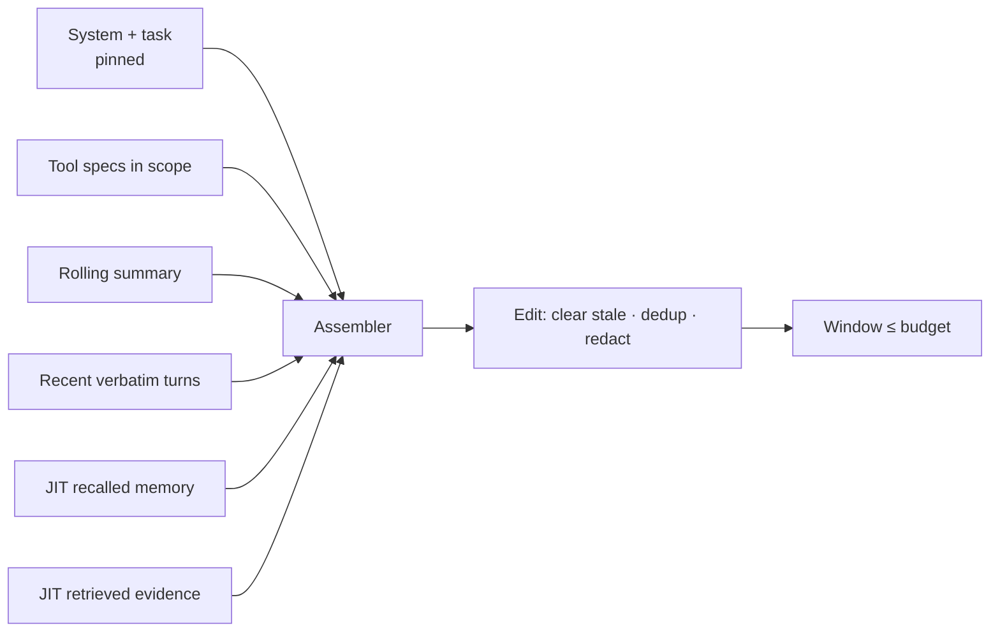

# 09 — Context Engineering

> Managing the token lifecycle from the first system token to the last compacted summary. Part of OpenMate; see [architecture.md §12](architecture.md#12-context-engineering). A large share of agent failures trace to context drift/loss, not weak models — so the window is an explicitly managed resource.

## Scope & responsibilities

The `ContextPolicy` builds each turn's window from prioritized sources rather than blindly concatenating history. This module owns assembly, token budgeting, compaction, context editing/pruning, and offloading. It's invoked by the `ContextInterceptor` ([02](02-agent-loop-and-runtime.md)), reads from memory ([06](06-memory-and-state.md)) and RAG ([07](07-retrieval-rag.md)), uses the tokenizer from [03](03-model-port-and-providers.md), and respects redaction/sensitivity from [10](10-safety-and-guardrails.md).

---

## Core abstractions (class level)

```python
# openmate/ports/context.py
@dataclass
class TokenBudget:
    max_context: int; reserve_output: int
    def available(self, used: int) -> int: return self.max_context - self.reserve_output - used

@dataclass
class ContextItem:
    role: Role; parts: list[Part]
    priority: int                       # higher = keep under pressure
    pinned: bool = False                # never evicted (system prompt, current task)
    est_tokens: int = 0
    source: Literal["system","tools","memory","summary","recent","rag","scratch"] = "recent"

class ContextPolicy(Protocol):
    def assemble(self, state: RunState, budget: TokenBudget, svc: Services) -> list[Message]: ...

class ContextSource(Protocol):          # contributes candidate items
    async def gather(self, state: RunState, svc: Services) -> list[ContextItem]: ...
```

---

## Phase 0 — PoC (foundational)

**Goal:** a budget-aware assembler that never overflows the window.

```python
class DefaultContextPolicy(ContextPolicy):
    def assemble(self, state, budget, svc):
        items = [pin(system(state.agent)), pin(tool_specs(state))]      # always kept
        items += [recent(m) for m in state.messages]                   # newest first
        return pack(items, budget, svc.tokenizer)                      # drop lowest-priority until it fits

def pack(items, budget, tok):
    kept, used = [], 0
    for it in sorted(items, key=lambda i: (i.pinned, i.priority), reverse=True):
        if it.pinned or used + it.est_tokens <= budget.available(used):
            kept.append(it); used += it.est_tokens
    return to_messages(restore_order(kept))
```

PoC behavior: keep system prompt + tool specs pinned, then as many recent turns as fit; drop oldest first. Estimate tokens with the tokenizer.

**PoC acceptance:** a long conversation never exceeds `max_context`; pinned items always survive; the model still gets coherent recent history.

---

## Phase 1 — Compaction

When the transcript nears the limit, summarize older turns and reinitialize the window with the summary + recent verbatim turns — the primary defense against context exhaustion on long runs.

```python
class Compactor:
    def __init__(self, model: Model, keep_recent=6, trigger_ratio=0.8): ...
    async def maybe_compact(self, state, budget, svc) -> RunState:
        if est(state.messages) < trigger_ratio * budget.max_context: return state
        old, recent = state.messages[:-self.keep_recent], state.messages[-self.keep_recent:]
        summary = await self._summarize(old, svc)          # structured: decisions, facts, open loops
        return state.replace(messages=[summary_msg(summary), *recent],
                             scratch={**state.scratch, "compactions": +1})
```

Techniques: **structured summaries** (preserve decisions, established facts, open tasks — not prose); **summary of summaries** for very long runs; **lossless offload** of compacted detail to the store so it's recoverable ([06](06-memory-and-state.md)).

---

## Phase 2 — Context editing & pruning

Keep the live window lean *during* a run, not just at the limit.

- **Stale tool-result clearing:** once a tool result has been used, replace it with a short reference (`[result #3 cleared — re-fetch if needed]`). Large measured token reductions on tool-heavy runs, often with a quality *lift* (less distraction).
- **Dedup & redact:** drop duplicate retrievals; redact sensitive parts for the window per [10](10-safety-and-guardrails.md).
- **Selective thinking retention:** keep recent `ThinkingPart`s, drop old ones.

```python
class ContextEditor:                       # an assembler stage / interceptor
    def edit(self, items: list[ContextItem]) -> list[ContextItem]:
        items = clear_stale_tool_results(items)
        items = dedup(items); items = redact(items)
        return items
```

---

## Phase 3 — Retrieval, memory & offloading

- **Just-in-time injection:** pull RAG evidence ([07](07-retrieval-rag.md)) and recalled memory ([06](06-memory-and-state.md)) only for turns that need them, then evict — the window holds pointers, not payloads.
- **Memory offloading / external scratchpad:** persist long working notes to the store/filesystem; keep a compact index in-context and re-read on demand ("the filesystem as context").
- **Source prioritization:** a scoring function ranks candidate items (recency, relevance to current goal, salience) so the budget is spent on what matters.



---

## Phase 4 — Advanced & multi-agent context

- **Isolation for sub-agents:** each sub-agent ([08](08-multi-agent-orchestration.md)) gets its own clean window so a parent doesn't bloat with worker chatter; only distilled results return.
- **Context compression:** learned/extractive compression of long passages before insertion.
- **Layered instruction hierarchy:** system → developer → task → tool guidance, with clear precedence (also a safety boundary, [10](10-safety-and-guardrails.md)).
- **KV-cache-aware ordering:** keep stable prefixes first to maximize prompt-cache hits ([03](03-model-port-and-providers.md) Phase 4) — cheaper and faster.
- **Adaptive budgeting:** allocate more window to reasoning vs. evidence based on task type.

---

## Testing & verification

- **Never-overflow invariant:** fuzz long transcripts; assert assembled tokens ≤ budget and pinned items always present.
- **Compaction fidelity:** key facts/decisions survive compaction (LLM-judge on a checklist); compacted detail is recoverable from the store.
- **Editing safety:** clearing stale results never removes a result still referenced by a pending tool call.
- **Impact measurement:** A/B each technique (compaction, editing, JIT) in the eval harness ([11](11-observability-and-evaluation.md)) — adopt by measured lift, not faith.

## Trade-offs & open questions

Compaction loses detail — tune `keep_recent`/trigger and rely on offload for recovery. Aggressive editing can drop something needed (conservative defaults). JIT retrieval adds latency per turn. KV-cache-aware ordering vs. priority-based ordering can conflict (reconcile: stable prefix pinned, dynamic tail prioritized).
