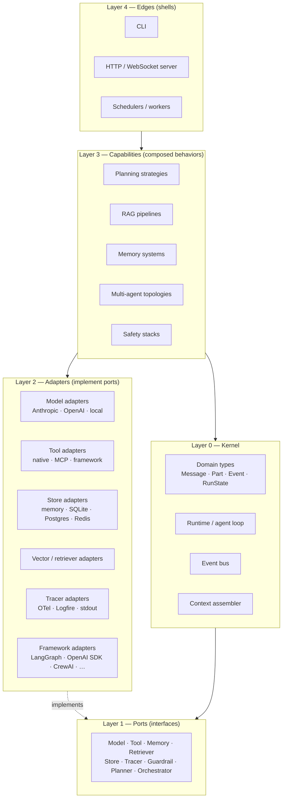
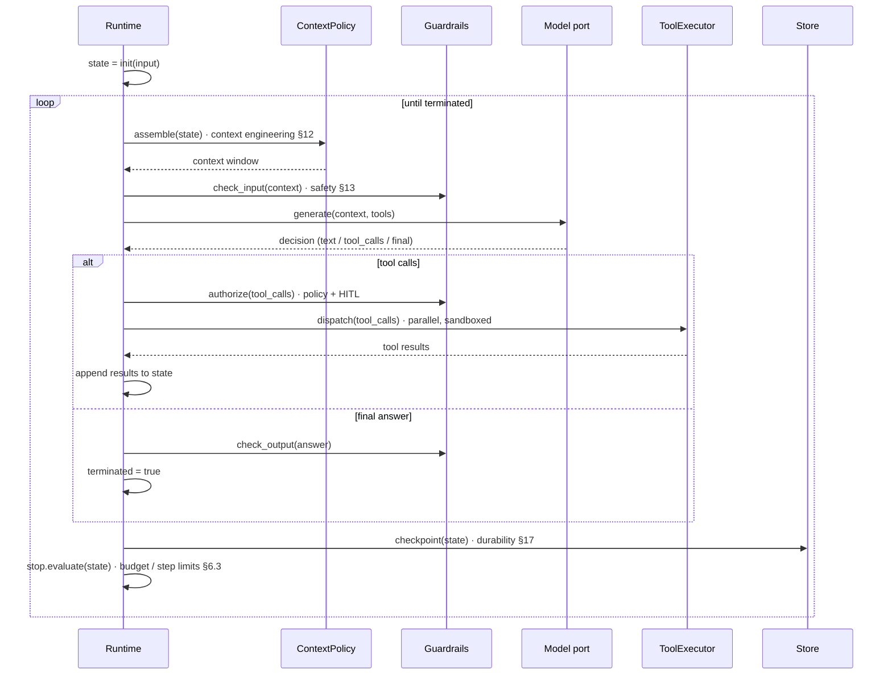
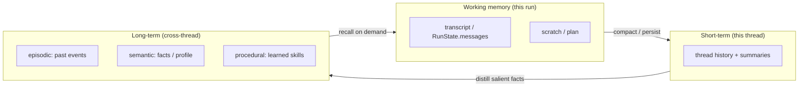
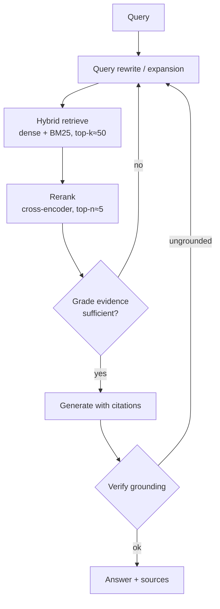
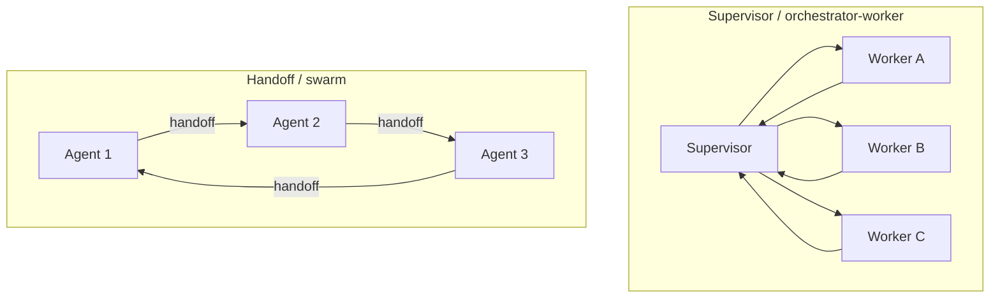
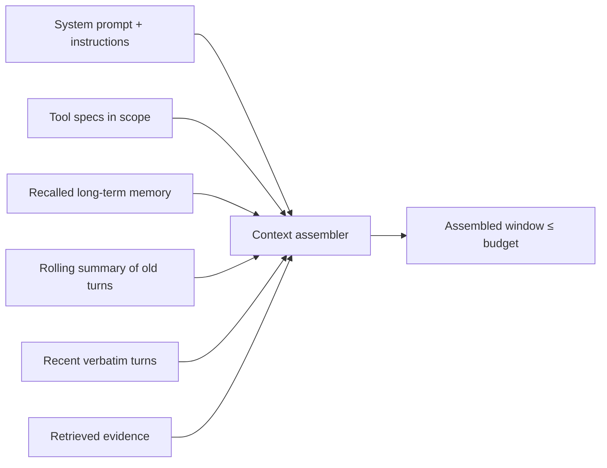
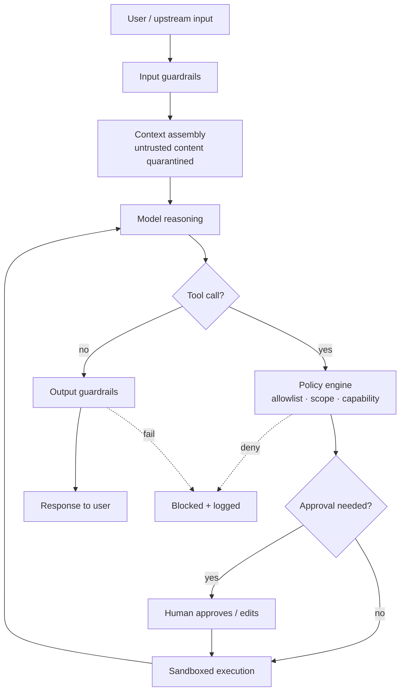
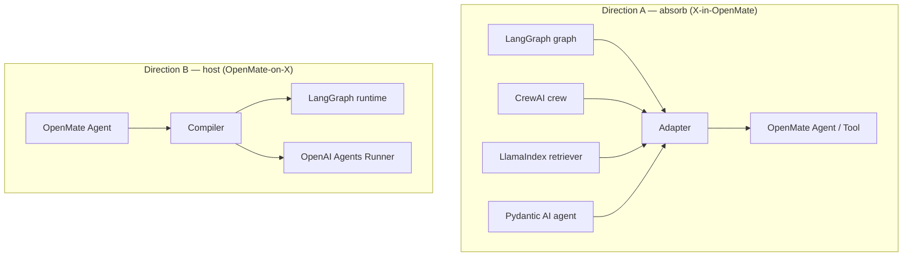

# OpenMate — Design & Reference Architecture

> A from-scratch, provider-agnostic, framework-interoperable architecture for building AI agents — and a teaching reference for the patterns behind them.

**Status:** Draft v0.1 · **Owner:** Alan · **Last updated:** 2026-06-22

> Framework-specific details in this document (LangGraph, OpenAI Agents SDK, CrewAI, AutoGen/AG2, LlamaIndex, Pydantic AI, MCP) were verified against their June 2026 state. APIs move fast; treat the *concepts* as stable and re-check exact signatures before implementing an adapter.

---

## Table of contents

1. [What OpenMate is](#1-what-openmate-is)
2. [Goals & non-goals](#2-goals--non-goals)
3. [Design principles](#3-design-principles)
4. [Architectural overview](#4-architectural-overview)
5. [The core domain model (the kernel)](#5-the-core-domain-model-the-kernel)
6. [The agent loop](#6-the-agent-loop)
7. [Planning & reasoning strategies](#7-planning--reasoning-strategies)
8. [Tools & capabilities (incl. MCP)](#8-tools--capabilities-incl-mcp)
9. [Memory & state](#9-memory--state)
10. [Retrieval (RAG)](#10-retrieval-rag)
11. [Multi-agent orchestration](#11-multi-agent-orchestration)
12. [Context engineering](#12-context-engineering)
13. [Safety & guardrails](#13-safety--guardrails)
14. [The model (LLM) port — provider abstraction](#14-the-model-llm-port--provider-abstraction)
15. [Framework interoperability](#15-framework-interoperability)
16. [Observability & evaluation](#16-observability--evaluation)
17. [Production concerns](#17-production-concerns)
18. [Package & directory layout](#18-package--directory-layout)
19. [Reference interfaces (Python)](#19-reference-interfaces-python)
20. [Worked examples](#20-worked-examples)
21. [Roadmap](#21-roadmap)
22. [Glossary & references](#22-glossary--references)

---

## 1. What OpenMate is

OpenMate is a personal proof-of-concept for a Claude-style AI agent, built deliberately from first principles rather than on top of a single framework. It has two intertwined purposes:

1. **A working agent.** A real, runnable agent that can reason, call tools, retrieve knowledge, plan, collaborate with other agents, and run safely in production-like conditions.
2. **A reference architecture.** A clean, documented decomposition of *what an agent actually is*, expressed as a small set of stable abstractions ("ports") plus interchangeable implementations ("adapters"). Every major pattern in the field — ReAct, plan-and-execute, reflection, agentic RAG, supervisor/handoff orchestration, layered safety — should be expressible as a configuration of these abstractions, not a rewrite.

The defining constraint is **interchangeability**. OpenMate's kernel must not depend on any single agent framework or model provider. Instead it should be able to (a) run *on top of* popular runtimes (LangGraph, the OpenAI Agents SDK runner, etc.), and (b) *absorb* components from those ecosystems (a CrewAI crew, a LlamaIndex retriever, a Pydantic AI typed agent) by wrapping them behind OpenMate ports. The goal is to understand agents deeply enough that no framework is load-bearing.

This is explicitly a learning and experimentation vehicle, so the architecture favors **legibility over cleverness**: small interfaces, explicit data flow, observable everything, and patterns introduced in progressive layers you can read top to bottom.

---

## 2. Goals & non-goals

### Goals

- **Provider-agnostic by construction.** The LLM is a swappable port from day one. No code outside `adapters/models/*` knows whether it's talking to Anthropic, OpenAI, a local model via an OpenAI-compatible server, or a fake used in tests.
- **Framework-interoperable in both directions.** Map OpenMate concepts cleanly onto LangGraph, OpenAI Agents SDK, CrewAI, AutoGen/AG2, LlamaIndex, and Pydantic AI — and wrap their components as OpenMate ports.
- **Pattern-complete.** Demonstrate the canonical agent patterns: planning, the agent loop, tool use, memory, RAG, multi-agent orchestration, context engineering, and safety — each as a first-class, documented module.
- **Production-shaped.** Durability/checkpointing, concurrency, cost/latency budgets, retries/fallback, evaluation, and tracing are designed in, not bolted on.
- **Observable & replayable.** Every run is a stream of typed events that can be traced, persisted, and replayed deterministically (given recorded model outputs).
- **Small, typed kernel.** The core is a few hundred lines of types and one control loop. Everything else is an adapter or a capability composed from the kernel.

### Non-goals

- **Not a framework to compete with LangGraph/CrewAI.** OpenMate is a reference and a personal agent, not a product. Where an ecosystem tool is better, OpenMate should *adapt* it, not reinvent it.
- **Not maximal performance.** Clarity wins ties against micro-optimization. (Concurrency and caching are in scope; hand-tuned token packing is not.)
- **Not a UI/product surface.** The scope ends at a programmatic API plus a thin CLI/HTTP shell. Chat UIs, auth, and billing are out.
- **Not model training.** OpenMate consumes models; it does not fine-tune or serve them.

---

## 3. Design principles

**P1 — Ports & adapters (hexagonal).** The kernel defines *ports* (Python `Protocol`s) for everything external: the model, tools, memory, retrieval, state storage, tracing, and guardrails. Concrete *adapters* implement them. The agent loop depends only on ports, so any dependency is swappable and fakeable.

**P2 — Everything is an event.** A run is an ordered stream of typed events (`MessageAdded`, `ToolCallRequested`, `ToolReturned`, `PlanUpdated`, `GuardrailTriggered`, ...). The UI, tracer, evaluator, and persistence layer are all just consumers of this stream. This makes the system observable and replayable by default.

**P3 — Mechanism vs. policy.** The kernel provides *mechanism* (a loop that assembles context, calls a model, dispatches tools, checkpoints state). *Policy* — how to plan, when to stop, what to retrieve, what to block — lives in pluggable strategy objects. New behavior is new policy, not a forked loop.

**P4 — Progressive disclosure.** A useful agent should be ~30 lines (model + tools + loop). Planning, memory, RAG, multi-agent, and safety are *additive layers* you opt into. The reader can understand the system one layer at a time.

**P5 — Provider- and framework-neutral data.** The canonical `Message`/`Part` types are OpenMate's own, modeled on the union of what providers support (text, tool calls, tool results, images, thinking). Adapters translate at the boundary; the core never speaks a vendor dialect.

**P6 — Typed and validated.** Tool arguments and structured outputs are JSON-Schema/Pydantic validated. Invalid model output is a recoverable event (re-prompt with the error), not an exception — the same self-correction loop Pydantic AI popularized.

**P7 — Safe by default, capable by configuration.** The default posture is least-privilege: tools are explicitly granted, side-effecting tools require policy approval, and untrusted content is quarantined from instructions. You widen capability deliberately.

**P8 — Deterministic where possible.** Given recorded model responses, a run replays identically. All nondeterminism (model calls, clock, randomness, tool I/O) goes through ports that can be recorded and stubbed.

---

## 4. Architectural overview

OpenMate is organized as five concentric layers. Dependencies point inward only: outer layers may depend on inner ones, never the reverse.



- **Layer 0 — Kernel.** The irreducible core: domain types, the agent loop (`Runtime`), the event bus, and context assembly. Has zero third-party dependencies beyond the standard library and a validation lib.
- **Layer 1 — Ports.** Pure interfaces (`Protocol`s). The kernel and capabilities are written against these.
- **Layer 2 — Adapters.** Concrete implementations of ports: model providers, tool sources (including MCP and other frameworks' tools), state stores, vector backends, tracers, and *framework adapters* that let OpenMate run on or absorb other runtimes.
- **Layer 3 — Capabilities.** Reusable behaviors composed from kernel + ports: a plan-and-execute strategy, an agentic-RAG pipeline, a hierarchical-memory system, a supervisor orchestrator, a guardrail stack.
- **Layer 4 — Edges.** Thin shells that drive the system: a CLI, an HTTP/WebSocket server (streaming events), and background workers/schedulers.

A single agent is just an `Agent` value (model + tools + policies) handed to the `Runtime`. A multi-agent system is an `Orchestrator` coordinating several agents over shared or message-passed state. Both are observed through the same event stream and persisted through the same `Store`.

---

## 5. The core domain model (the kernel)

Everything in OpenMate is built from a handful of types. They are intentionally close to the *intersection-plus-union* of what modern providers expose, so adapters translate with minimal loss.

### 5.1 Messages and content parts

A conversation is a list of `Message`s. A message has a role and a list of typed **content parts** — this multi-part model is what lets a single representation carry text, tool calls, tool results, images, and model "thinking" without special-casing providers.

```python
Role = Literal["system", "user", "assistant", "tool"]

@dataclass(frozen=True)
class TextPart:        text: str
@dataclass(frozen=True)
class ImagePart:       data: bytes | str; mime: str           # bytes or URL
@dataclass(frozen=True)
class ThinkingPart:    text: str; signature: str | None = None  # provider reasoning
@dataclass(frozen=True)
class ToolCallPart:    id: str; name: str; args: dict
@dataclass(frozen=True)
class ToolResultPart:  call_id: str; content: list["Part"]; is_error: bool = False

Part = TextPart | ImagePart | ThinkingPart | ToolCallPart | ToolResultPart

@dataclass
class Message:
    role: Role
    content: list[Part]
    name: str | None = None              # for named agents / tool roles
    metadata: dict = field(default_factory=dict)
```

### 5.2 The run state

`RunState` is the complete, serializable state of one agent execution. It *is* the checkpoint: persist it and you can resume or replay.

```python
@dataclass
class RunState:
    thread_id: str
    messages: list[Message]              # the transcript
    plan: Plan | None = None             # current plan, if any
    scratch: dict = field(default_factory=dict)   # strategy-private working memory
    step: int = 0
    status: Literal["running", "paused", "done", "error"] = "running"
    usage: Usage = field(default_factory=Usage)    # tokens, cost, wall-time
    cursor: dict = field(default_factory=dict)     # for resuming mid-tool / HITL
```

### 5.3 Events

Every state transition emits a typed `Event`. The event stream is the system's public narration — consumed by the UI, tracer, evaluator, and persistence.

```python
class Event: ...                      # base; all carry thread_id, step, ts
@dataclass class RunStarted(Event):       input: "Input"
@dataclass class MessageAdded(Event):     message: Message
@dataclass class ModelRequested(Event):   request: ModelRequest
@dataclass class ModelStreamed(Event):    delta: StreamDelta
@dataclass class ToolCallRequested(Event):call: ToolCallPart
@dataclass class ToolReturned(Event):     result: ToolResultPart; ms: float
@dataclass class PlanUpdated(Event):      plan: Plan
@dataclass class GuardrailTriggered(Event): name: str; action: str; detail: dict
@dataclass class HandoffOccurred(Event):  from_: str; to: str; reason: str
@dataclass class CheckpointSaved(Event):  rev: int
@dataclass class RunFinished(Event):      result: "RunResult"
```

### 5.4 The agent and its services

An `Agent` is declarative configuration — *what* the agent is. It carries no execution logic; the `Runtime` interprets it.

```python
@dataclass
class Agent:
    name: str
    model: Model                                  # port (§14)
    instructions: str | Callable[[RunContext], str]
    tools: list[Tool] = field(default_factory=list)
    memory: Memory | None = None                  # port (§9)
    planner: ReasoningStrategy | None = None       # port (§7); default = ReAct
    context_policy: ContextPolicy = DefaultContextPolicy()   # §12
    guardrails: GuardrailSet = field(default_factory=GuardrailSet)  # §13
    stop: StopPolicy = DefaultStopPolicy(max_steps=20)        # §6.3
    handoffs: list["Agent"] = field(default_factory=list)     # §11
```

`Services` is the bundle of resolved ports the loop hands to strategies and tools (model, tracer, store, retriever, clock, rng). Threading it explicitly — rather than reaching for globals — is what keeps runs deterministic and testable (P8).

These ~6 type groups (`Part`, `Message`, `RunState`, `Event`, `Agent`, `Services`) are the entire vocabulary. The rest of the document is *what you do with them*.

---

## 6. The agent loop

The agent loop is OpenMate's heart and its most important teaching artifact. Nearly every agent shipped today is a specialization of three patterns first written down in 2022–2023 — **ReAct**, **plan-and-execute**, and **reflection** — so OpenMate provides *one generalized loop* with pluggable phases, and expresses those patterns as configurations rather than separate engines.

### 6.1 The generalized control loop



In words: assemble the context from current state, screen it, ask the model what to do next, and either execute the tools it requested (then loop) or accept its final answer (then stop) — checkpointing after every step and enforcing budget limits throughout. This is a ReAct loop, but each labeled phase is a replaceable port, which is what lets the same loop express every other pattern.

### 6.2 Phases as middleware

The loop body is an ordered **interceptor chain**, so cross-cutting concerns compose without editing the loop. Each interceptor wraps the next, can short-circuit, and observes the event stream.

```python
class StepInterceptor(Protocol):
    async def __call__(self, ctx: StepContext, nxt: Callable) -> StepOutcome: ...

# Default chain (outer → inner):
#   TracingInterceptor          # open a span per step
#   BudgetInterceptor           # enforce token/time/cost ceilings
#   InputGuardrailInterceptor   # screen assembled context
#   ContextInterceptor          # assemble + compact the window
#   ReasoningInterceptor        # call the strategy (ReAct / plan / reflect)
#   ToolAuthInterceptor         # policy checks + HITL pause
#   ToolExecInterceptor         # dispatch (parallel, sandbox, retry)
#   OutputGuardrailInterceptor  # screen final answers
#   CheckpointInterceptor       # persist RunState
```

Adding capabilities — a semantic cache, a PII redactor, a cost meter — means inserting an interceptor, not forking the runtime (P3). This mirrors LangGraph's node-wrapping and Pydantic AI's history processors, but stays framework-neutral.

### 6.3 Termination & control

Long-horizon agents fail by *not stopping* as often as by stopping early. `StopPolicy` is a first-class, composable port evaluated every step:

- **Natural stop** — the model emits a final answer with no tool calls.
- **Budget stop** — step count, wall-clock, token, or dollar ceiling reached.
- **Goal stop** — a verifier/critic confirms the success criterion (links to reflection, §7.3).
- **No-progress stop** — repeated identical tool calls or oscillation detected (loop-guard).
- **External stop** — caller cancellation, or a HITL reviewer halts the run.

On any non-natural stop the runtime returns a `RunResult` with `status` and `reason`, never a half-state — the last good checkpoint is always restorable.

### 6.4 Streaming & resumption

`Runtime.run()` returns a final `RunResult`; `Runtime.stream()` yields the event stream live (for UIs and token streaming). Because `RunState` is a complete checkpoint (§5.2) and tool execution records a `cursor`, a run can pause for human approval or survive a crash and **resume mid-loop** — the basis for durability (§17) and human-in-the-loop (§13).

---

## 7. Planning & reasoning strategies

Planning is *policy*, injected as a `ReasoningStrategy` — the swappable decision-maker inside the `ReasoningInterceptor`. It owns one question: *given the current state, what is the next step?* This single port is where ReAct, plan-and-execute, reflection, and tree-of-thought differ.

```python
class ReasoningStrategy(Protocol):
    async def step(self, state: RunState, svc: Services) -> StepOutcome: ...
    # StepOutcome = ToolCalls(list[ToolCallPart]) | Final(Message) | Subgoal(Task)
```

### 7.1 ReAct (default)

Interleaves reasoning and acting in a tight loop: the model produces a thought, picks a tool, observes the result, and decides the next thought, terminating when it emits a final answer. It is the right default for open-ended tasks where the path is discovered by doing. In OpenMate it's the trivial strategy: one model call per step, returning either tool calls or a final answer. Low latency, maximal adaptivity, but it can drift on long, structured tasks.

### 7.2 Plan-and-execute

Separates planning from execution: a **planner** model writes a full multi-step plan up front, then an **executor** runs the steps — re-planning only when reality diverges. It's better for long, structured tasks where mid-stream drift is costly, and it cuts cost by reserving the expensive "thinking" model for planning while a cheaper model executes steps. OpenMate represents the plan explicitly so it is observable and editable:

```python
@dataclass
class PlanStep: id: str; goal: str; tool_hint: str | None; status: StepStatus; result: Any = None
@dataclass
class Plan:     steps: list[PlanStep]; rationale: str; revision: int = 0
```

The plan lives on `RunState.plan`, emits `PlanUpdated` events, and supports **plan repair**: when a step fails or an observation invalidates assumptions, the strategy patches the remaining plan rather than restarting. A human can also edit the plan during a HITL pause.

### 7.3 Reflection / Reflexion

Adds a self-evaluation step: after producing a candidate result, a **critic** (the same or a different model) critiques it against the goal, and the actor revises — looping until the critic is satisfied or a budget is hit. It's the highest-accuracy pattern (it reliably adds double-digit points on hard coding/reasoning benchmarks) at the cost of extra model calls. OpenMate implements it as a wrapper strategy:

```python
class Reflexion(ReasoningStrategy):
    def __init__(self, actor: ReasoningStrategy, critic: Critic, max_revisions=2): ...
    # run actor → critic.assess() → if rejected, append critique and retry
```

Because reflection is just a strategy that wraps another strategy, you get "ReAct-with-reflection" or "plan-execute-with-reflection" for free.

### 7.4 Tree-of-Thought / search (advanced)

For tasks with verifiable intermediate states, a search strategy expands multiple candidate branches, scores them with a value function, and keeps the best — beam/MCTS-style. It's expensive and reserved for puzzle-like problems; OpenMate ships it as an optional strategy to demonstrate that "planning" generalizes from a single line of reasoning to a search over reasoning.

### 7.5 Choosing a strategy

| Strategy | Best for | Cost | Drift control | Notes |
|---|---|---|---|---|
| ReAct | open-ended, exploratory tasks | low | low | the sensible default |
| Plan-and-execute | long, structured pipelines | medium | high | enables cheap-executor split |
| Reflection | quality-critical outputs | high | medium | composes over any strategy |
| Tree-of-Thought | verifiable search problems | very high | high | optional / niche |

All four implement the same port, so switching is a one-line change to `Agent.planner` — the loop, tools, memory, and tracing are unchanged.

---

## 8. Tools & capabilities (incl. MCP)

Tools are how an agent affects and senses the world. OpenMate's `Tool` port is deliberately tiny; everything else (MCP servers, other frameworks' tools, sub-agents) becomes a `Tool` via an adapter.

```python
@dataclass
class ToolSpec:
    name: str
    description: str                 # the model reads this — it is prompt surface
    parameters: dict                 # JSON Schema for args
    side_effecting: bool = True      # read-only tools skip approval (§13)
    timeout_s: float = 30.0

class Tool(Protocol):
    spec: ToolSpec
    async def invoke(self, args: dict, ctx: RunContext) -> ToolResult: ...
```

### 8.1 Tool design guidance

A tool's `description` and schema are part of the prompt, so they are designed, not dashed off: name by intent, document failure modes, and return *model-legible* errors (a `ToolResult` with `is_error=True` and a fix-it hint) instead of raising — the model can then self-correct within the loop. Tools should be **idempotent or clearly marked** so retries and replays are safe (§17).

### 8.2 Dispatch: parallelism, sandboxing, retries

The `ToolExecutor` runs independent tool calls **concurrently** (the model often emits several), enforces per-tool timeouts, retries transient failures with backoff, and routes side-effecting or untrusted tools through a **sandbox** (subprocess, container, or remote worker) so file/network/exec access is contained. Results stream back as `ToolReturned` events.

### 8.3 The tool registry & scoping

Agents don't get the global tool list; they get a **scoped registry**. Scoping (per agent, per run, per user) is both a capability and a safety boundary (§13) — least privilege means an agent can only call what it was explicitly granted. Registries also handle name collisions across sources (native vs. MCP vs. framework) via namespacing.

### 8.4 MCP — the interoperability backbone

The **Model Context Protocol** is OpenMate's primary way to acquire third-party tools and data. MCP servers expose three primitives, which OpenMate maps onto its own concepts:

| MCP primitive | What it is | OpenMate mapping |
|---|---|---|
| **Tools** | executable operations with side effects | `Tool` (via `MCPToolAdapter`) |
| **Resources** | read-only data access | `Retriever`/`Resource` source (§10) |
| **Prompts** | reusable prompt templates | context fragments / canned instructions |

A client/server **capability-negotiation handshake** discovers what each side supports. Transports are **stdio** (local subprocess servers) and **Streamable HTTP** (remote servers); the 2026 spec direction makes the protocol layer effectively **stateless**, adds routing headers so gateways can load-balance without reading the body, and adds cache hints (`ttlMs`, `cacheScope`) on list/read results. OpenMate's `MCPClient` adapter:

- mounts one or more MCP servers and exposes their tools/resources through the standard ports;
- caches `tools/list` per the server's cache hints, refreshing on TTL expiry;
- applies the same scoping, approval, and tracing as native tools — an MCP tool is not privileged just because it's external.

OpenMate can also **expose itself as an MCP server**, publishing selected internal tools/agents so other systems (including other agents) can consume them — the symmetric half of interoperability. For agent-to-agent calls across systems, OpenMate speaks **A2A** (agent-to-agent) where peers support it; locally, agents-as-tools (§11.5) is the simpler path.

---

## 9. Memory & state

OpenMate distinguishes three time-scales of memory, each a different mechanism. Conflating them is a common source of bugs.



- **Working memory** is `RunState` itself — the live transcript, plan, and scratch. It lives in the context window and is bounded by context engineering (§12).
- **Short-term memory** is the persisted thread: full history plus rolling summaries, restored when a conversation resumes. Backed by the `Store` port.
- **Long-term memory** is cross-thread knowledge, split into *episodic* (what happened before), *semantic* (durable facts, user profile, preferences), and *procedural* (reusable how-tos). Backed by the `Memory` port, typically over a vector store plus a key-value store.

```python
class Memory(Protocol):
    async def recall(self, query: MemoryQuery, ctx: RunContext) -> list[MemoryItem]: ...
    async def remember(self, items: list[MemoryItem], ctx: RunContext) -> None: ...
    async def forget(self, selector: MemorySelector, ctx: RunContext) -> None: ...
```

**Memory as a tool vs. automatic recall.** OpenMate supports both: an explicit `memory.search`/`memory.write` tool the agent controls (the model decides when to remember/recall, à la the memory-tool pattern), *and* an automatic recall interceptor that injects relevant long-term items into context based on the current turn. The explicit form is more legible and auditable; the automatic form is lower-friction. They share the same `Memory` port.

**Writing policy.** What gets promoted to long-term memory is itself a policy: write-on-explicit-instruction, write-on-summary (distill at end of run), or write-on-salience (a small model flags durable facts). OpenMate defaults to explicit + end-of-run distillation to avoid memory pollution, and never persists sensitive PII to long-term stores without an explicit flag (§13).

**State persistence.** The `Store` port is the durability substrate for short-term memory *and* checkpoints (they're the same `RunState`):

```python
class Store(Protocol):
    async def load(self, thread_id: str) -> RunState | None: ...
    async def save(self, thread_id: str, state: RunState) -> int: ...   # returns revision
    async def history(self, thread_id: str) -> list[Checkpoint]: ...     # time-travel
```

Adapters: `InMemoryStore` (tests), `SQLiteStore` (local/PoC default), `PostgresStore`/`RedisStore` (production). Keeping `history()` enables **time-travel debugging** and forking a run from any past checkpoint — the same capability LangGraph's checkpointers provide, behind OpenMate's port.

---

## 10. Retrieval (RAG)

Retrieval grounds the agent in external knowledge. OpenMate treats RAG as a **spectrum**, from a single retrieval call to retrieval-as-a-tool the agent drives itself, and ships the rungs as composable pieces rather than a monolithic pipeline.



### 10.1 The retriever port and the ingestion pipeline

```python
class Retriever(Protocol):
    async def retrieve(self, query: str, *, k: int, filters: dict | None = None) -> list[Document]: ...

class Indexer(Protocol):
    async def ingest(self, docs: Iterable[RawDoc]) -> IngestReport: ...   # chunk → embed → upsert
```

Ingestion (load → clean → **chunk** → embed → index, with metadata) is half the battle; OpenMate makes chunking and embedding strategies pluggable because they dominate quality.

### 10.2 The rungs of the ladder

- **Naive RAG** — embed query, fetch top-k, stuff into context. The baseline; fine for easy questions.
- **Hybrid + rerank** — combine dense (embeddings) and sparse (BM25) retrieval, then a cross-encoder reranker narrows top-50 → top-5. This single upgrade fixes most retrieval failures and is OpenMate's recommended default for quality-sensitive work.
- **Agentic RAG** — retrieval becomes a **tool** the agent calls, possibly many times across multiple retrievers, judging its own results and re-querying when they're insufficient. This is just an OpenMate agent (§6) whose toolset is retrievers — no special machinery. The right choice for hard, multi-hop questions where latency is acceptable.
- **Corrective / self-RAG** — a grader critiques retrieved evidence; if weak or missing, it triggers another retrieval pass (or a web fallback) before generating. Implemented as the reflection strategy (§7.3) applied to retrieval.
- **GraphRAG** — retrieve over a knowledge graph for multi-hop and relational questions; markedly reduces hallucination on connected data at the cost of build complexity.
- **Multimodal RAG** — retrieve across text/images/tables via multimodal embeddings.

### 10.3 Grounding & citations

Generated answers must carry **citations** back to retrieved spans, and an optional verification step checks that claims are supported by the cited evidence (rejecting ungrounded output via an output guardrail, §13). This closes the loop between RAG and safety: retrieval reduces hallucination only if generation is held to the evidence.

### 10.4 Evaluation

RAG quality is measured separately for retrieval (recall@k, MRR) and generation (faithfulness/groundedness, answer relevance) — RAGAS-style metrics wired into the eval harness (§16) so changes to chunking, embeddings, or reranking are measured, not guessed.

---

## 11. Multi-agent orchestration

When one agent's context, toolset, or responsibilities grow unwieldy, decompose into several specialized agents. Orchestration is *policy* over multiple agents, captured by the `Orchestrator` port. OpenMate ships the canonical topologies; all coordinate through either **shared state** or **message passing**, and all emit the same event stream.

```python
class Orchestrator(Protocol):
    async def run(self, task: Task, agents: AgentRegistry, svc: Services) -> RunResult: ...
```



### 11.1 Supervisor (orchestrator-worker)

A supervisor agent decomposes a task, routes subtasks to specialist workers, and synthesizes their results — workers report back to the supervisor, which owns the overall plan. This is the most broadly useful topology (it's how "deep research" systems are built) and OpenMate's default for non-trivial multi-agent work. Maps to LangGraph supervisor graphs, OpenAI Agents SDK handoffs-to-and-back, and Claude-style subagents.

### 11.2 Handoff / swarm

Control transfers **peer-to-peer**: an agent decides another is better suited and hands off, transferring the conversation so the receiver continues seamlessly. There's no central coordinator — routing is emergent. OpenMate models a handoff as a special `StepOutcome` that swaps the active agent while keeping `RunState`; it emits a `HandoffOccurred` event. Maps directly to the OpenAI Agents SDK's handoffs and OpenAI Swarm.

### 11.3 Role-based crew (sequential / hierarchical)

A fixed set of role-defined agents executes a process — sequential (a pipeline) or hierarchical (a manager delegates). This is CrewAI's model: strong prototype ergonomics for well-understood workflows. OpenMate provides `SequentialOrchestrator` and `HierarchicalOrchestrator` and can also *wrap a CrewAI crew* as a single OpenMate agent (§15).

### 11.4 Conversational group chat / debate

Several agents converse in a shared thread under a manager that selects who speaks next — good for dynamic problem-solving, negotiation, and debate-style verification where agents critique each other. This is AutoGen/AG2's `GroupChat` model; OpenMate's `GroupChatOrchestrator` implements speaker-selection as a policy and is the basis for multi-agent debate as a quality technique.

### 11.5 Agent-as-tool

The simplest composition: wrap an entire agent as a `Tool` so a parent agent calls it like any function. No new orchestration concept — it reuses the tool port. Best when a sub-capability has a clean input/output contract and doesn't need to see the parent's conversation.

### 11.6 Communication & shared state

| Mechanism | How agents share | Best for | OpenMate construct |
|---|---|---|---|
| Shared state / blackboard | read/write a common `RunState` slice | tightly-coupled collaboration | `SharedStateOrchestrator` |
| Message passing | explicit messages between agents | loose coupling, auditability | `MessageBus` |
| Handoff | transfer the whole conversation | routing/triage | `HandoffOutcome` |
| Agent-as-tool | request/response call | clean sub-capabilities | `AgentTool` |

**Cost & failure caveats.** Multi-agent systems multiply token cost and add coordination failure modes (lost updates, deadlock, runaway delegation). OpenMate applies a *global* budget and loop-guard across the whole orchestration (not just per agent), and prefers the simplest topology that works — often a single agent with good tools beats a crew.

---

## 12. Context engineering

Context engineering — owning the full token lifecycle from the first system-prompt token to the last compacted summary — is what separates demos from durable long-horizon agents. A large share of agent failures trace to **context drift or memory loss** during multi-step reasoning rather than to a weak model, so OpenMate makes the context window an explicitly *managed* resource via the `ContextPolicy` port.

```python
class ContextPolicy(Protocol):
    def assemble(self, state: RunState, budget: TokenBudget, svc: Services) -> list[Message]: ...
```

The assembler builds each turn's window from prioritized sources rather than blindly concatenating history:



Techniques OpenMate composes:

- **Compaction** — when the transcript nears the limit, summarize older turns and reinitialize the window with the summary plus recent verbatim turns. This is the primary defense against context exhaustion on long runs.
- **Context editing / pruning** — automatically clear stale tool calls and bulky tool results once they're no longer needed, keeping the live window lean (a large measured token reduction on long tool-heavy runs, with a quality *lift* because the model isn't distracted by stale data).
- **Sliding window + hierarchical summary** — keep the last N turns verbatim under a tree of summaries at coarser granularity for older history.
- **Memory offloading** — push detail out to the `Store`/`Memory` and pull back on demand, so the window holds pointers, not payloads. The filesystem/store becomes external memory.
- **Just-in-time retrieval** — inject RAG evidence and recalled memory only for the turns that need them, then evict.
- **Isolation** — give sub-agents their own clean windows (§11) so a parent's context doesn't bloat with a worker's intermediate chatter.

Each technique is an interceptor or an assembler strategy, so you can measure their individual impact in the eval harness (§16) rather than adopting them on faith.

---

## 13. Safety & guardrails

Safety in OpenMate is **layered defense**, not a single filter. Each layer is independently testable, and the posture is least-privilege by default (P7). The threat model centers on three things: harmful or malformed *output*, *misuse of tools* (especially side-effecting ones), and *prompt injection* via untrusted content the agent reads.



### 13.1 Guardrail port

```python
class Guardrail(Protocol):
    stage: Literal["input", "tool", "output"]
    async def check(self, payload, ctx: RunContext) -> GuardResult: ...
    # GuardResult = Allow() | Block(reason) | Modify(payload) | RequireApproval()
```

### 13.2 The layers

- **Input guardrails** — screen incoming content for PII, policy violations, jailbreak patterns, and off-topic/abuse before it reaches the model. Cheap classifiers run first; expensive ones gate only when needed.
- **Untrusted-content quarantine** — content fetched from the web, documents, or tool results is structurally separated from instructions (clearly delimited, never concatenated as if it were a system directive). This is the core **prompt-injection** defense: the model is told that quarantined text is data, not commands, and tool authority is not granted on its say-so.
- **Tool policy engine** — every side-effecting call passes an allowlist + scope + capability check before execution. Read-only tools can be auto-approved; destructive ones (send email, delete, pay) require explicit policy or human approval. This is the highest-leverage safety layer because tools are where agents touch the real world.
- **Human-in-the-loop (HITL)** — the runtime can pause at a tool boundary, surface the proposed action for approval/editing, and resume from the checkpoint after a decision. Because pausing/resuming is built into the loop (§6.4), HITL is configuration, not a special mode.
- **Sandboxing** — code execution, file access, and network calls run in an isolated environment (subprocess/container/remote worker) with resource and egress limits, so a compromised or buggy tool can't reach the host.
- **Output guardrails** — validate the final response: schema conformance, content policy, citation/grounding checks (§10.3), and PII redaction before it leaves.
- **Budgets & rate limits** — token/cost/step ceilings and per-tool rate limits bound runaway loops and cost-based abuse (§17).
- **Audit log** — every guardrail decision, tool authorization, and handoff is an event, persisted for after-the-fact review and incident analysis.

### 13.3 Financial & irreversible actions

OpenMate **never** executes irreversible high-stakes actions (moving money, placing orders, mass deletion) autonomously. Such tools are marked `requires_approval` and routed through HITL regardless of policy — a deliberate, conservative default the operator can only loosen explicitly.

---

## 14. The model (LLM) port — provider abstraction

The provider abstraction is non-negotiable (P1): no code outside the model adapters knows which provider is in use. The `Model` port normalizes generation, tool calling, structured output, streaming, and usage accounting across providers, and advertises **capabilities** so the loop can adapt to differences instead of assuming a lowest common denominator.

```python
@dataclass(frozen=True)
class ModelCapabilities:
    tool_calling: bool
    parallel_tools: bool
    structured_output: bool          # native JSON-schema-constrained output
    vision: bool
    thinking: bool                   # exposes reasoning parts
    prompt_caching: bool
    max_context: int

@dataclass
class ModelResponse:
    message: Message                 # may contain text / tool calls / thinking
    usage: Usage                     # prompt/completion tokens, cost, latency
    finish_reason: Literal["stop", "tool_calls", "length", "filter"]
    raw: Any = None                  # provider payload, for debugging only

class Model(Protocol):
    name: str
    capabilities: ModelCapabilities
    async def generate(self, messages: list[Message], *,
                       tools: list[ToolSpec] | None = None,
                       output_schema: type | None = None,
                       **opts) -> ModelResponse: ...
    def stream(self, messages, *, tools=None, **opts) -> AsyncIterator[StreamDelta]: ...
```

### 14.1 What adapters absorb

Each adapter (`AnthropicModel`, `OpenAIModel`, `OpenAICompatibleModel` for local/Ollama/vLLM, `FakeModel` for tests) hides the provider's quirks: message/tool-call wire formats, tool-call vs. function-call vs. Responses-API conventions, streaming event shapes, reasoning/thinking exposure, prompt-caching controls, and token accounting. The kernel only ever sees OpenMate `Message`s and a `ModelResponse`.

### 14.2 Capability-aware degradation

When a chosen model lacks a capability, the runtime degrades gracefully rather than failing:

- **No native structured output** → fall back to JSON-mode + schema validation + re-prompt-on-failure (the Pydantic-AI-style self-correction loop).
- **No parallel tools** → serialize tool calls.
- **No native tool calling** → use a prompted ReAct format and parse tool calls from text.

### 14.3 Routing, fallback, and cost control

A `RouterModel` is itself a `Model` that wraps several backends and chooses per call — cheap model for routine steps, strong model for planning/reflection (§7.2), with automatic **fallback** to a secondary provider on error or rate-limit. Because it implements the same port, routing is invisible to the agent. This is where multi-provider posture pays off: provider outages and price changes become a config edit. An adapter backed by a multi-provider proxy (e.g., a LiteLLM-style gateway) is one valid implementation, but it remains *an adapter*, never a kernel dependency.

---

## 15. Framework interoperability

Interoperability runs in **two directions**, and OpenMate supports both so it depends on no single framework while benefiting from all of them.



**Direction A — absorb.** Wrap any external component behind an OpenMate port. A LangGraph graph or CrewAI crew becomes an `Agent` (or an `AgentTool`); a LlamaIndex index becomes a `Retriever`; a Pydantic AI agent becomes an `Agent` whose typed output maps to a structured `ModelResponse`; any MCP server's tools become `Tool`s. This is the common case and needs only an adapter per component.

**Direction B — host.** Compile an OpenMate `Agent`/orchestration down to another runtime when you want that runtime's execution guarantees — e.g., emit a LangGraph state graph to get its durable checkpointing and time-travel, or run an OpenMate agent inside the OpenAI Agents `Runner`. This is more involved (it's a code-gen/translation layer) and is provided for the orchestrators where it's worth it.

### 15.1 Concept mapping

OpenMate's vocabulary maps cleanly onto each ecosystem, which is what makes adapters small:

| OpenMate | LangGraph | OpenAI Agents SDK | CrewAI | AutoGen / AG2 | LlamaIndex | Pydantic AI |
|---|---|---|---|---|---|---|
| `Runtime` (loop) | Pregel graph runtime | `Runner` | `Crew.kickoff()` | `GroupChatManager` | `Workflow` runtime | `Agent.run()` |
| `Agent` | node / compiled subgraph | `Agent` | `Agent` (role) | `ConversableAgent` | `FunctionAgent` | `Agent` |
| `ReasoningStrategy` | graph wiring | (implicit loop) | process type | chat pattern | workflow steps | (implicit) |
| `Tool` | tool node | function tool | tool | registered function | `FunctionTool` | tool |
| `Orchestrator` | graph edges / `Command` | handoffs | `Process` seq/hier | `GroupChat` | `AgentWorkflow` | (graph) |
| `Store` / checkpoint | checkpointer (Postgres/Redis) | `Sessions` | memory | — | `Context` | durable execution |
| `Guardrail` | custom node | `Guardrails` (in/out) | custom | custom | — | output validators / HITL approval |
| `Model` port | chat model | model (Responses API) | LLM | model client | LLM | `Model` (model-agnostic) |
| `Retriever` | custom | file/vector tools | knowledge source | — | `Retriever`/index (native) | tools |
| `Tracer` | LangSmith | built-in tracing | events | — | callbacks | Logfire / OTel |

### 15.2 The Claude SDK stance

OpenMate **supports** the Claude/Anthropic SDK as a first-class model adapter and tool/MCP source, and can run as a Claude-style agent — but it does **not depend** on it. Anthropic-specific features (prompt caching, extended thinking, the memory tool, MCP) are exposed through capability flags and adapters, so an Anthropic-backed OpenMate is fully featured while a swap to any other provider stays a config change.

---

## 16. Observability & evaluation

You cannot improve what you cannot see, and agents are notoriously hard to see into. OpenMate is **trace-first**: the event stream (§5.3) is the observability substrate, and the `Tracer` port projects it onto standards.

### 16.1 Tracing

```python
class Tracer(Protocol):
    def span(self, name: str, **attrs) -> ContextManager[Span]: ...
    def record(self, event: Event) -> None: ...
```

OpenMate emits traces conforming to the **OpenTelemetry GenAI semantic conventions**, which define `agent`, `workflow`, `tool`, and `model` spans plus token-usage and latency metrics. Each step opens a span; each model call, tool call, and retrieval becomes a child span, so a run is a tree that captures the agent's *decision graph*, not just its I/O boundary. Adapters target OTel collectors, Logfire, LangSmith, or plain stdout for local debugging. Because traces are derived from the canonical event stream, switching backends never touches application code.

### 16.2 Evaluation

Tracing tells you *what happened*; evaluation tells you whether it was *good*. Note that the OTel GenAI conventions deliberately stop at attributes/usage/latency and **do not** cover output quality or safety scoring — so OpenMate adds a dedicated eval layer:

- **Component evals** — retrieval (recall@k, MRR), generation (faithfulness, relevance), tool-arg correctness, guardrail precision/recall.
- **Trajectory evals** — did the agent take a sensible path? (step count, redundant calls, plan adherence, loop incidents).
- **Outcome evals** — task success against a rubric, scored by an LLM judge and/or programmatic checks.
- **Replay evals** — re-run recorded traces against a new prompt/model/strategy and diff outcomes (enabled by deterministic replay, P8).

Evals run in CI as **gates**: a prompt, tool, or strategy change that regresses the eval suite fails the build. This is how the "balanced" reference stays honest — every pattern claim in this doc is something the harness can measure.

---

## 17. Production concerns

The model is a small fraction of a production agent; the bulk is operational infrastructure around it. OpenMate designs for that reality.

**Durability & checkpointing.** State is checkpointed every step (§5.2, §9), so a crashed run resumes from the last good `RunState`. A caveat worth internalizing: **checkpointing is not the same as durable execution** — naive snapshotting can resume into an inconsistent world (e.g., a tool side effect that did happen but isn't reflected in the restored state). OpenMate addresses this with *semantics-aware* checkpoints (record tool-call cursors and idempotency keys so resumed runs don't double-execute) and an optional **durable-execution backend** (e.g., a Temporal-style workflow engine, or compiling to LangGraph's durable runtime via §15) for workflows that demand exactly-once guarantees.

**Concurrency & scale.** The runtime is async; workers are **stateless** and load state from the `Store`, so you scale horizontally by adding workers behind a queue. Tool dispatch is concurrent within a step (§8.2).

**Cost & latency.** Every run accrues a `Usage` budget enforced by the `BudgetInterceptor`. Levers: model routing (§14.3), prompt caching, a **semantic cache** interceptor for repeated queries, context compaction to shrink windows (§12), and the cheap-executor/strong-planner split (§7.2).

**Reliability.** Provider calls get retries with jittered backoff, timeouts, circuit-breaking, and fallback models. Tools are idempotent or carry idempotency keys so retries/replays are safe.

**Rate limiting & quotas.** Per-user and per-tool limits guard cost and abuse; backpressure surfaces as events, not crashes.

**Versioning.** Prompts, tool specs, agent configs, and strategies are versioned artifacts; traces record which versions ran, so a regression is traceable to a change and runs are reproducible.

**Security & secrets.** Secrets are injected at the adapter boundary (never in prompts or state); sandboxing (§13) contains tool blast radius; the audit log captures every privileged action. Untrusted content is quarantined (§13.2).

**Deployment shape.** A typical deployment: stateless runtime workers + a `Store` (Postgres/Redis) + an MCP/tool tier (sandboxed) + an OTel collector + the model provider(s) behind a router. The CLI and HTTP server are thin edges over the same `Runtime`.

---

## 18. Package & directory layout

The package structure mirrors the layered architecture (§4): dependencies point inward, and each port has a sibling adapters folder. A reader can open `kernel/` to understand the whole system, then descend into capabilities and adapters as needed.

```
openmate/
├── kernel/                  # Layer 0 — no third-party deps beyond validation
│   ├── types.py             # Message, Part, RunState, Event, Agent, Usage
│   ├── runtime.py           # the agent loop + interceptor chain
│   ├── interceptors.py      # tracing, budget, guardrail, checkpoint, ...
│   ├── context.py           # ContextPolicy + default assembler
│   ├── events.py            # event bus
│   └── errors.py
├── ports/                   # Layer 1 — Protocols only
│   ├── model.py  tool.py  memory.py  retriever.py
│   ├── store.py  tracer.py  guardrail.py
│   └── planner.py  orchestrator.py
├── strategies/              # Layer 3 — reasoning/planning
│   ├── react.py  plan_execute.py  reflexion.py  tot.py
├── rag/                     # Layer 3 — retrieval
│   ├── pipeline.py  hybrid.py  rerank.py  agentic.py  graph.py  ingest.py
├── memory/                  # Layer 3 — memory systems
│   ├── working.py  short_term.py  long_term.py  policies.py
├── orchestration/           # Layer 3 — multi-agent
│   ├── supervisor.py  handoff.py  crew.py  groupchat.py  agent_tool.py
├── safety/                  # Layer 3 — guardrails
│   ├── input.py  output.py  policy.py  sandbox.py  hitl.py  injection.py
├── adapters/                # Layer 2 — implement ports
│   ├── models/      anthropic.py  openai.py  openai_compat.py  router.py  fake.py
│   ├── tools/       native.py  mcp_client.py  mcp_server.py
│   ├── stores/      memory.py  sqlite.py  postgres.py  redis.py
│   ├── vectors/     chroma.py  pgvector.py  …
│   ├── tracers/     otel.py  logfire.py  stdout.py
│   └── frameworks/  langgraph.py  openai_agents.py  crewai.py  autogen.py  llamaindex.py  pydantic_ai.py
├── eval/                    # §16 — harness, metrics, judges, replay
├── edges/                   # Layer 4 — CLI, HTTP/WS server, workers
└── examples/                # §20 — runnable walkthroughs
```

---

## 19. Reference interfaces (Python)

The interfaces below are the contract a reader implements against. They use `typing.Protocol` (structural typing, so adapters need not inherit) and `async` throughout. Types from §5/§14 are assumed imported.

```python
# ports/tool.py
class Tool(Protocol):
    spec: ToolSpec
    async def invoke(self, args: dict, ctx: "RunContext") -> ToolResult: ...

# ports/planner.py
StepOutcome = Union["ToolCalls", "Final", "Subgoal", "Handoff"]
class ReasoningStrategy(Protocol):
    async def step(self, state: RunState, svc: "Services") -> StepOutcome: ...

# ports/orchestrator.py
class Orchestrator(Protocol):
    async def run(self, task: "Task", agents: "AgentRegistry", svc: "Services") -> "RunResult": ...

# ports/memory.py / retriever.py / store.py / guardrail.py / tracer.py
#   (as defined in §9, §10, §13, §16)

# kernel/runtime.py — the public surface
class Runtime:
    def __init__(self, svc: "Services", interceptors: list[StepInterceptor] | None = None): ...
    async def run(self, agent: Agent, input: "Input", *, thread_id: str | None = None) -> "RunResult": ...
    def stream(self, agent: Agent, input: "Input", *, thread_id: str | None = None) -> AsyncIterator[Event]: ...
    async def resume(self, thread_id: str, decision: "HumanDecision | None" = None) -> "RunResult": ...
```

A minimal but complete loop, to show the kernel really is small:

```python
async def run(self, agent, input, *, thread_id=None):
    state = await self._init(agent, input, thread_id)
    strategy = agent.planner or ReAct(agent.model)
    while state.status == "running":
        async with self.svc.tracer.span("step", step=state.step):
            ctx = agent.context_policy.assemble(state, self._budget(state), self.svc)
            await agent.guardrails.run("input", ctx, self.svc)         # §13
            outcome = await strategy.step(state.replace(messages=ctx), self.svc)  # §7
            match outcome:
                case ToolCalls(calls):
                    await agent.guardrails.run("tool", calls, self.svc)  # policy + HITL
                    results = await self.executor.dispatch(calls, agent, self.svc)  # §8
                    state = state.append(results)
                case Final(msg):
                    await agent.guardrails.run("output", msg, self.svc)
                    state = state.finish(msg)
                case Handoff(to, reason):
                    agent = to; self.svc.bus.emit(HandoffOccurred(...))   # §11
            await self.svc.store.save(state.thread_id, state)            # §17
            state = agent.stop.evaluate(state)                           # §6.3
    return state.to_result()
```

Everything else in OpenMate — planning, RAG, memory, multi-agent, safety — is reachable by swapping `strategy`, the guardrail set, the toolset, or wrapping `run` in an `Orchestrator`. That is the payoff of the ports-and-adapters design.

---

## 20. Worked examples

Each example is a configuration of the same kernel; the diff between them is the lesson.

### 20.1 Minimal ReAct agent (~the "hello world")

```python
agent = Agent(
    name="assistant",
    model=AnthropicModel("claude-…"),           # swap to OpenAIModel(...) freely
    instructions="You are a helpful research assistant.",
    tools=[WebSearchTool(), CalculatorTool()],
)
result = await Runtime(default_services()).run(agent, Input.text("Compare A and B."))
```

### 20.2 Agentic RAG Q&A

Add a retriever-backed tool and a grounding output guardrail; the agent decides when to retrieve (§10.2). No loop changes.

```python
agent = Agent(
    name="docs-qa",
    model=RouterModel(strong=…, cheap=…),
    instructions="Answer only from retrieved sources; cite them.",
    tools=[RetrieveTool(HybridRetriever(index, reranker=CrossEncoderReranker()))],
    guardrails=GuardrailSet(output=[GroundingGuardrail(), CitationGuardrail()]),
)
```

### 20.3 Plan-and-execute with reflection

Swap the strategy; tools and everything else are unchanged (§7.2–7.3).

```python
agent = replace(agent, planner=Reflexion(
    actor=PlanExecute(planner_model=strong, executor_model=cheap),
    critic=RubricCritic(strong),
))
```

### 20.4 Multi-agent "deep research" (supervisor)

```python
supervisor = SupervisorOrchestrator(
    supervisor=Agent(name="lead", model=strong, instructions="Decompose and synthesize."),
    workers=[search_agent, code_agent, writer_agent],
    budget=Budget(max_dollars=2.0, max_steps=60),    # global, across all agents (§11.6)
)
result = await supervisor.run(Task("Write a report on X"), registry, default_services())
```

### 20.5 Swapping the world

The point of the architecture, in four edits: change `model=` to move providers; change `store=` (SQLite→Postgres) to move from laptop to production; add `tools=[*mcp_client.tools()]` to mount an MCP server; wrap a `CrewAI` crew via `frameworks.crewai.as_agent(crew)` and drop it into the orchestrator. None of these touch the kernel.

---

## 21. Roadmap

A staged build that keeps a runnable agent at every milestone (P4).

- **M0 — Kernel.** Domain types, event bus, the loop, ContextPolicy, `FakeModel`, `InMemoryStore`. Deterministic replay test harness. *Exit:* a ReAct agent runs against `FakeModel` end-to-end.
- **M1 — Real tools & providers.** Anthropic + OpenAI adapters, native tool executor with sandboxing, MCP client. CLI edge. *Exit:* a useful single agent with web search + code tools.
- **M2 — Memory & RAG.** `Store` (SQLite), short/long-term memory, ingestion + hybrid retrieve + rerank, agentic RAG, grounding guardrail. *Exit:* a cited docs-QA agent.
- **M3 — Planning.** Plan-and-execute and reflection strategies; plan repair; loop-guards. *Exit:* measurable accuracy lift on a hard task suite.
- **M4 — Multi-agent.** Supervisor, handoff, crew, group-chat orchestrators; agent-as-tool; global budgets. *Exit:* a deep-research example.
- **M5 — Safety & production.** Full guardrail stack, HITL pause/resume, OTel tracing, eval gates in CI, Postgres store, retries/fallback/router, semantic cache. *Exit:* deployable HTTP service with budgets and audit.
- **M6 — Framework interop.** Adapters to absorb LangGraph/CrewAI/LlamaIndex/Pydantic AI components; compile-to-LangGraph host path; expose-as-MCP-server. *Exit:* the same agent runs on two runtimes and absorbs one foreign component.

Cross-cutting from M0: every milestone ships with evals and traces; nothing is "done" until the harness can measure it.

---

## 22. Glossary & references

**Glossary.** *Port* — an interface the kernel depends on. *Adapter* — a concrete implementation of a port. *Agent* — declarative config (model + tools + policies). *Runtime* — the engine that interprets an agent (the loop). *Strategy* — pluggable next-step decision policy (planning). *Orchestrator* — policy over multiple agents. *RunState* — the complete, serializable state of one execution (and the checkpoint). *Interceptor* — middleware wrapping the loop body. *Capability* — a behavior composed from kernel + ports.

**Key sources (verified June 2026).**

- Anthropic — [Building effective agents](https://www.anthropic.com/research/building-effective-agents) and [Effective context engineering for AI agents](https://www.anthropic.com/engineering/effective-context-engineering-for-ai-agents)
- OpenAI Agents SDK — [docs](https://openai.github.io/openai-agents-python/) and [guardrails](https://openai.github.io/openai-agents-python/guardrails/)
- LangGraph — [durable execution](https://docs.langchain.com/oss/python/langgraph/durable-execution); nuance: [checkpoints are not durable execution](https://www.diagrid.io/blog/checkpoints-are-not-durable-execution-why-langgraph-crewai-google-adk-and-others-fall-short-for-production-agent-workflows)
- Pydantic AI — [repo](https://github.com/pydantic/pydantic-ai) and [docs](https://pydantic.dev/docs/ai/overview/)
- CrewAI vs AutoGen/AG2 — [comparison](https://dev.to/agentsindex/ag2-vs-crewai-the-complete-comparison-including-the-autogen-rebrand-explained-248l)
- Model Context Protocol — [specification](https://modelcontextprotocol.io/specification/2025-11-25) and [2026 roadmap](https://blog.modelcontextprotocol.io/posts/2026-mcp-roadmap/)
- Agentic RAG patterns — [production guide](https://www.teacherandtask.com/blog/advanced-rag-patterns-2026-production-engineering-guide)
- OpenTelemetry GenAI semantic conventions — [GenAI observability](https://opentelemetry.io/blog/2026/genai-observability/)
- Agent design patterns — [ReAct / Plan-and-Execute / Reflection](https://dev.to/gabrielanhaia/react-plan-and-execute-or-reflection-the-three-agent-patterns-every-engineer-needs-in-2026-355p)

---

*End of design v0.1. This document is the contract; implementations live behind the ports it defines.*
