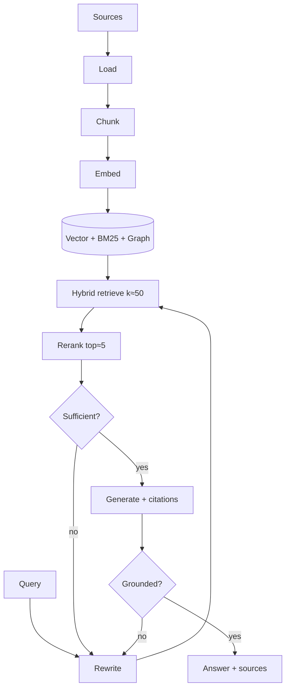

# 07 — Retrieval (RAG)

> Grounding the agent in external knowledge. Part of OpenMate; see [architecture.md §10](architecture.md#10-retrieval-rag). RAG is a **spectrum** of composable pieces, from one retrieval call to retrieval-as-a-tool the agent drives itself.

## Scope & responsibilities

This module owns ingestion (load → chunk → embed → index), the `Retriever` port and its variants (dense, sparse, hybrid, reranked, graph, multimodal), grounded generation with citations, and RAG evaluation. It reuses the embeddings port and routing from [03](03-model-port-and-providers.md), shares the vector backend with memory ([06](06-memory-and-state.md)), and exposes retrieval to agents as a `Tool` ([04](04-tools-and-mcp.md)) for agentic RAG. Grounding checks tie into output guardrails ([10](10-safety-and-guardrails.md)).

---

## Core abstractions (class level)

```python
# openmate/ports/retriever.py
@dataclass
class Document:
    id: str; text: str; metadata: dict
    score: float = 0.0; embedding: Vector | None = None

class Retriever(Protocol):
    async def retrieve(self, query: str, *, k: int, filters: dict | None = None) -> list[Document]: ...

class Indexer(Protocol):
    async def ingest(self, docs: Iterable["RawDoc"]) -> "IngestReport": ...

# pluggable ingestion stages
class Loader(Protocol):   async def load(self, src) -> Iterable["RawDoc"]: ...
class Chunker(Protocol):  def split(self, doc: "RawDoc") -> list["Chunk"]: ...
class Embedder(Protocol): async def embed(self, texts: list[str]) -> list[Vector]: ...   # from 03
class VectorStore(Protocol):
    async def upsert(self, items: list["VectorRecord"]) -> None: ...
    async def query(self, vec: Vector, *, k: int, filters=None) -> list[Document]: ...  # filters: {"library_id": {"$in": [...]}}
    async def get(self, ids: list[str]) -> list["VectorRecord"]: ...   # move/copy/preview — see §Scoping and shared libraries
    async def count(self) -> int: ...
    async def delete(self, ids: list[str] | None = None) -> None: ...
```

---

## Phase 0 — PoC (foundational): naive RAG

**Goal:** ingest documents and answer questions grounded in them — the simplest end-to-end pipeline.

```python
# ingest: load → fixed-size chunk → embed → upsert
class NaivePipeline:
    async def ingest(self, src):
        for doc in self.loader.load(src):
            chunks = self.chunker.split(doc)                 # PoC: fixed window + overlap
            vecs = await self.embedder.embed([c.text for c in chunks])
            await self.store.upsert(zip(chunks, vecs))
# retrieve + generate
class DenseRetriever(Retriever):
    async def retrieve(self, query, *, k, filters=None):
        v = (await self.embedder.embed([query]))[0]
        return await self.store.query(v, k=k, filters=filters)
```

Ship one `VectorStore` adapter (Chroma or `sqlite-vec` for zero-infra PoC) and a `RetrieveTool` wrapper so an agent can call retrieval. Generation just stuffs top-k into context with a "answer from these sources" instruction.

**PoC acceptance:** ask a question; the agent retrieves relevant chunks and answers from them; irrelevant questions return "not found in sources."

---

## Phase 1 — Hybrid retrieval + reranking (the quality default)

The single highest-leverage upgrade — fixes most retrieval failures.

```python
class HybridRetriever(Retriever):
    def __init__(self, dense: Retriever, sparse: Retriever, fusion="rrf"): ...
    async def retrieve(self, query, *, k, filters=None):
        d, s = await gather(self.dense.retrieve(query,k=50), self.sparse.retrieve(query,k=50))
        return reciprocal_rank_fusion(d, s)[:k]              # combine dense + BM25

class Reranker(Protocol):
    async def rerank(self, query: str, docs: list[Document], top_n: int) -> list[Document]: ...
class CrossEncoderReranker(Reranker): ...                    # retrieve top-50 → rerank top-5
```

Pipeline: **query rewrite/expansion** → **hybrid (dense + BM25)** → **rerank (cross-encoder)** → generate. Add **metadata filtering** (date, source, ACL) and **chunk-then-expand** (retrieve small, return surrounding context).

---

## Phase 2 — Agentic & corrective RAG

Make retrieval a decision the agent controls.

- **Agentic RAG:** retrieval is a `Tool` the agent calls — possibly many times, across multiple retrievers — judging results and re-querying when insufficient. This is *just an OpenMate agent* ([02](02-agent-loop-and-runtime.md)) whose tools are retrievers; no special engine. Right for hard, multi-hop questions where latency is acceptable.
- **Corrective / Self-RAG:** a grader critiques retrieved evidence; if weak/missing, trigger another pass or a web fallback before generating. Implemented as reflection ([05](05-planning-and-reasoning.md)) applied to retrieval.

```python
class AgenticRAG:                              # composed, not a new primitive
    tools = [RetrieveTool(vector), RetrieveTool(web), GradeEvidenceTool()]
    # the agent loops: retrieve → grade → (re-query | answer with citations)
```

- **Query planning:** decompose a complex question into sub-queries, retrieve per sub-query, then synthesize (multi-hop).

---

## Phase 3 — Advanced indexing & retrieval

As many techniques as the corpus warrants:

- **GraphRAG:** build an entity/relation graph; retrieve subgraphs for relational/multi-hop questions — large hallucination reductions on connected data, at build cost (shares graph memory, [06](06-memory-and-state.md)).
- **Hierarchical / RAPTOR:** cluster + summarize chunks into a tree; retrieve at the right granularity.
- **Semantic / structure-aware chunking:** split on meaning or document structure (headings, code blocks) instead of fixed windows.
- **Multi-vector / late interaction (ColBERT-style):** token-level matching for higher recall.
- **HyDE:** generate a hypothetical answer, embed *that* to retrieve.
- **Multimodal RAG:** image/table/text retrieval via multimodal embeddings ([03](03-model-port-and-providers.md)).
- **Contextual retrieval:** prepend chunk-level context summaries before embedding to reduce ambiguity.

Each is a swappable `Chunker`/`Retriever`/`Indexer` implementation behind the same ports.

---

## Phase 4 — Grounding, citations & evaluation

- **Citations:** generation emits `CitedTextPart`s ([01](01-domain-model-and-kernel.md)) linking claims to retrieved spans.
- **Grounding verification:** an output guardrail ([10](10-safety-and-guardrails.md)) checks each claim is supported by cited evidence; ungrounded answers are rejected/retried. RAG only reduces hallucination if generation is *held to* the evidence.
- **Evaluation harness** ([11](11-observability-and-evaluation.md)), retrieval and generation measured separately:

| Stage | Metrics |
|---|---|
| Retrieval | recall@k, precision@k, MRR, nDCG |
| Generation | faithfulness/groundedness, answer relevance, citation accuracy |
| End-to-end | task success, latency, cost |

Wire these as CI gates so chunking/embedding/reranker changes are measured, not guessed.



## Scoping and shared libraries

**Reusing one knowledge base across threads.** By default each thread is its own knowledge base — `RetrieveTool` (`scope_to_thread=True`) tags every query with `thread_id`, and ingestion tags every chunk with `extra_metadata={"thread_id": …}` (`rag/tools.py`, `rag/pipeline.py`). Reuse generalizes that single tag into a **library**: a named bag of sources that any number of threads *attach*. A thread's private KB is simply a library whose id equals its `thread_id` (auto-created, auto-attached), so per-thread isolation is the degenerate one-member case of a many-to-many. Retrieval changes from `library_id == thread_id` to `library_id ∈ {the thread's attached libraries}`. The browser surface is [18](18-rag-ui.md).

### Two stores, one join

The vector DB stays **thread-agnostic** — a chunk carries only its `library_id`, never a thread. All relational structure (libraries, their sources, thread attachments) lives in the checkpoint store (`adapters/stores/sqlite.py`). The two are bridged by one column, `library_knowledge.chunk_ids`.

```
 VECTOR DB (single Chroma collection "openmate")      SQLite
   chunk: id, vector, text,                    libraries(library_id, name, kind,
          metadata{ library_id, source, … }              embedder, dim)
              ▲                                     │ 1:N
              │ query where library_id ∈ {…}   library_knowledge(library_id, source,
              │                                     chunk_ids ──────────────┐  added_at)
   filter compiled from ─ thread_libraries(thread_id, library_id) ◄─────────┘  (M:N)
```

### Vector-DB record

The upsert/query unit is `VectorRecord(id, vector, text, metadata)`:

```python
VectorRecord(
    id       = "lib_legal:policies/refund.pdf:7",   # {library_id}:{source}:{chunk_index}
    vector   = [...],                                # dim fixed by the library's embedder
    text     = "Enterprise refunds are prorated within 30 days …",
    metadata = {
        "library_id":  "lib_legal",                 # the ONLY key retrieval filters on
        "source":      "policies/refund.pdf",
        "chunk_index": 7,
        "source_type": "file",                      # optional; + loader passthrough for citations
    },
)
```

- **Single physical collection.** `ChromaVectorStore` keeps everything in one collection (`"openmate"`); libraries are logical (a metadata tag), not Chroma collections.
- **Scalar metadata only.** Chroma rejects list/`None` values (hence the `{"_": ""}` fallback in `upsert`), so `library_id` is a single string → **one library per chunk**. "Same source in two libraries" therefore means two physical copies, not a list-valued tag.
- **Library-qualified ids** so ingesting a source into a second library can't collide with the first (today's ids are path-only). Within a library the id is stable, preserving ingest idempotency.
- **No `thread_id` on chunks** — removed; that omission is the whole enabler.

### Relational schema (SQLite)

Generalizes the existing `thread_knowledge` table:

```sql
libraries(
  library_id TEXT PRIMARY KEY, name TEXT, kind TEXT,   -- 'private' | 'shared'
  embedder TEXT, dim INTEGER, created_at REAL)

library_knowledge(                                      -- was thread_knowledge
  library_id TEXT, source TEXT,
  chunk_ids  TEXT,                                      -- JSON list → the vector-DB join
  added_at   REAL, PRIMARY KEY (library_id, source))

thread_libraries(                                       -- NEW: the M:N attach
  thread_id TEXT, library_id TEXT,
  attached_at REAL, PRIMARY KEY (thread_id, library_id))
```

**Private-library convention:** a thread's first ingest auto-inserts `libraries(library_id=thread_id, kind='private')` + `thread_libraries(thread_id, thread_id)`; today's per-thread behavior falls out unchanged.

### CRUD operations

*Library*

| Op | SQLite | Vector DB |
|---|---|---|
| Create | `INSERT libraries` (embedder/dim fixed here) | — |
| List (all / shared / a thread's) | `SELECT libraries [JOIN thread_libraries]` | — |
| Rename | `UPDATE libraries.name` (embedder/dim immutable) | — |
| Delete | gather `chunk_ids`; `DELETE` from all three tables | `delete(ids)` |

*Source (chunks within a library)*

| Op | SQLite | Vector DB |
|---|---|---|
| Ingest / add | `UPSERT library_knowledge` | `upsert(records)`, ids `{lib}:{src}:{i}` |
| List sources | `SELECT … WHERE library_id` (`n_chunks = len(chunk_ids)`) | — |
| Preview chunks | read `chunk_ids` | `get(ids)` |
| Re-index | overwrite `chunk_ids` | `delete(old)` + `upsert(new)` |
| Remove | read `chunk_ids`; `DELETE` row | `delete(ids)` |
| Move / Copy | move/copy row | `get(old)` → `upsert(new id + library_id)` [+ `delete(old)`] |

*Attachment (thread ↔ library)*

| Op | SQLite | Vector DB |
|---|---|---|
| Attach | `INSERT thread_libraries` (reject embedder/dim mismatch) | — |
| List attached | `SELECT … WHERE thread_id` (feeds the retrieval filter) | — |
| Detach | `DELETE` row (never the private lib) | — |

*Retrieval & stats*

| Op | SQLite | Vector DB |
|---|---|---|
| Retrieve | resolve attached lib ids | `query(vec, k, where={"library_id": {"$in": ids}})` |
| Stats / count | `SUM(len(chunk_ids))` per library | (or global `count()`) |

### Creating and moving, concretely

- **Create** is just a `libraries` row plus a `library_id` you start tagging with — the vector DB is untouched until the first ingest. `build_agent(thread_id)` resolves attached libraries and constructs `RetrieveTool(retriever, base_filters={"library_id": {"$in": ids}}, scope_to_thread=False)`.
- **Promote in place** (share a chat's KB): flip the private library's `kind` to `shared` and name it — O(1), no vectors touched (the id stays `thread_id`, already attached).
- **Move / copy** to a clean library id **without re-embedding**: `get()` the stored vectors, `upsert` them under new library-qualified ids + `library_id`, then (move only) `delete` the originals. Attach the destination to the thread afterward, or it loses access to what it just moved.

### Vector-store port delta

Only `get()` is genuinely new; a small filter-operator dialect (`$in`) must be honored by both backends — Chroma supports it natively via `where=`, the in-memory store's `_matches` (currently exact-equality only) must learn it.

### Consistency (no cross-store transaction)

Writes span two stores, so fix an order and reconcile:

- **Add:** vectors first, then SQLite — a crash leaves orphan vectors (harmless), never a `chunk_ids` row pointing at missing vectors.
- **Delete:** vectors first, then the row — a stale row filters to nothing and re-delete is idempotent.
- **GC sweep:** delete any vector id absent from every `library_knowledge.chunk_ids` — the one primitive that repairs either failure.

Invariants: `library_knowledge.chunk_ids` ≡ the vector ids for that `(library_id, source)`; every chunk's `metadata.library_id` matches its row; one embedder + dim per library; a thread attaches only embedding-compatible libraries.

### Migration

`thread_knowledge → library_knowledge` (plus new `thread_libraries`, `libraries`); rename the chunk metadata key `thread_id → library_id`. Because a private library's id equals the old `thread_id`, existing tag *values* stay valid — migration is a one-shot metadata re-tag (Chroma `update`, or rewrite the in-memory JSON), or a transitional `{"$or": [{"library_id": …}, {"thread_id": …}]}` filter during rollout. Local/PoC data volume makes the one-shot re-tag cheap.

---

## Testing & verification

- **Golden retrieval set:** fixed queries with known-relevant docs; track recall@k across changes.
- **Ablations:** dense-only vs. hybrid vs. hybrid+rerank measured on the same set (prove the upgrade).
- **Faithfulness:** an LLM-judge + programmatic citation check flags unsupported claims.
- **Ingestion idempotency:** re-ingesting the same source doesn't duplicate chunks.
- **Shared libraries:** CRUD round-trip (create → ingest → attach from a *second* thread → retrieve → detach → delete); promote/move stays retrievable with **no re-embedding**; the `$in` filter returns identical hits on Chroma and in-memory; a crash-between-stores test leaves no dangling references after the GC sweep.

## Trade-offs & open questions

Chunk size/overlap (dominates quality — tune empirically). Latency budget for agentic vs. single-shot RAG. When GraphRAG's build cost is justified (relational/multi-hop corpora). Shared vs. dedicated vector store with memory ([06](06-memory-and-state.md)). Reranker hosting (API vs. local cross-encoder).

Shared libraries add: **library embedding uniformity** — all sources co-queried in a thread share one embedder + dim; cross-embedder attach is rejected, not silently merged. **Shared-write blast radius** — editing/removing a shared library affects every attached thread, so attach is always explicit. **Cross-library dedup** — scalar-only metadata means one chunk can't belong to many libraries, so identical sources in two libraries are duplicated (content-hash dedup is future work). **Two-store atomicity** — libraries span the vector DB + SQLite with no shared transaction; consistency relies on write ordering + a GC sweep.
