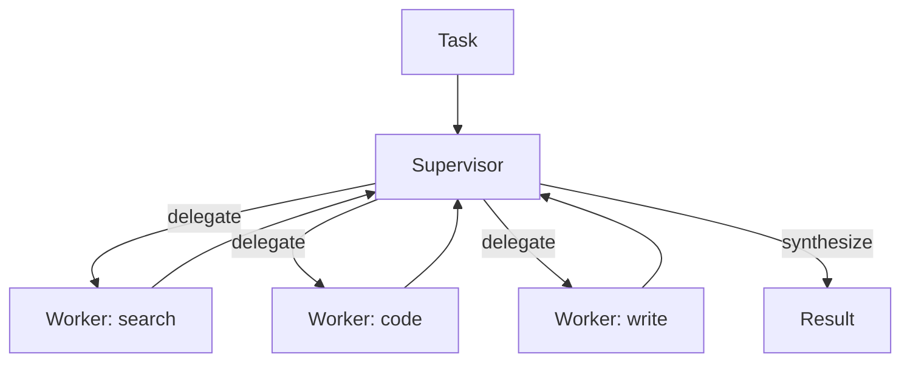

# 08 — Multi-Agent Orchestration

> Coordinating several specialized agents. Part of OpenMate; see [architecture.md §11](architecture.md#11-multi-agent-orchestration). Orchestration is *policy over multiple agents*, captured by the `Orchestrator` port — all topologies emit the same event stream and share one global budget.

## Scope & responsibilities

When one agent's context, toolset, or responsibilities grow unwieldy, decompose into specialists. This module owns the `Orchestrator` port and its topologies (supervisor, handoff/swarm, crew, group-chat, agent-as-tool), the inter-agent **communication substrate** (shared state vs. message passing vs. handoff), and cross-agent concerns (global budget, loop guards, result aggregation). Each agent still runs the same loop via `Agent.run()` ([02](02-agent-loop-and-runtime.md)); orchestration wraps and sequences those runs. Heuristic to keep central: **prefer the simplest topology that works** — often one agent with good tools beats a crew.

---

## Core abstractions (class level)

```python
# openmate/ports/orchestrator.py
@dataclass
class Task: goal: str; inputs: dict = field(default_factory=dict); parent_id: str | None = None
@dataclass
class AgentRegistry:
    agents: dict[str, Agent]
    def get(self, name) -> Agent: ...
    def by_skill(self, skill: str) -> list[Agent]: ...

class Orchestrator(Protocol):
    async def run(self, task: Task, agents: AgentRegistry, svc: Services) -> RunResult: ...

# shared coordination primitives
class MessageBus:                              # async inter-agent messaging
    async def send(self, to: str, msg: "AgentMessage") -> None: ...
    def inbox(self, agent: str) -> AsyncIterator["AgentMessage"]: ...
@dataclass
class Blackboard:                              # shared, reducer-merged state (01)
    state: dict; schema: StateSchema
    def update(self, patch: dict, by: str) -> None: ...
```

---

## Phase 0 — PoC (foundational): agent-as-tool + sequential

**Goal:** the two simplest compositions, needing no new runtime concepts.

- **Agent-as-tool:** wrap an entire agent as a `Tool` ([04](04-tools-and-mcp.md)) so a parent calls it like a function. Best when a sub-capability has a clean input/output contract and needn't see the parent's conversation.

```python
class AgentTool(Tool):
    def __init__(self, agent: Agent): self.agent = agent
    async def invoke(self, args, ctx):
        res = await self.agent.run(args["task"], thread_id=ctx.new_child())   # facade; isolated sub-run
        return ToolResult([TextPart(res.text)])           # clean window (sub-agent has its own Harness)
```

- **Sequential pipeline:** run agents in order, each consuming the prior's output.

```python
class SequentialOrchestrator(Orchestrator):
    def __init__(self, stages: list[Agent]): ...
    async def run(self, task, agents, svc):
        out = task.inputs
        for a in self.stages: out = (await a.run(out)).final   # facade; each stage consumes the prior's output
        return RunResult(final=out)
```

**PoC acceptance:** a parent agent delegates a subtask via `AgentTool`; a 3-stage pipeline (research → draft → edit) completes with one shared budget.

---

## Phase 1 — Supervisor (orchestrator-worker)

The most broadly useful topology (how "deep research" is built) — OpenMate's default for non-trivial multi-agent work. This is exactly Anthropic's **multi-agent research system**: a lead agent plans and decomposes the query, spawns subagents that research in parallel, then synthesizes their findings — their go-to for open-ended problems where the subtasks can't be predicted in advance. ([ref](https://www.anthropic.com/engineering/multi-agent-research-system))

```python
class SupervisorOrchestrator(Orchestrator):
    def __init__(self, supervisor: Agent, workers: list[Agent], budget: Budget): ...
    async def run(self, task, agents, svc):
        plan = await self._decompose(task, svc)            # supervisor splits work
        results = await self._dispatch(plan.subtasks, workers, svc)  # to specialists (parallel-able)
        return await self._synthesize(task, results, svc)  # supervisor merges
```

Techniques: **dynamic delegation** (supervisor chooses workers by skill at runtime); **parallel fan-out / map-reduce** for independent subtasks; **worker isolation** (each worker gets a clean `RunState`/window, [09](09-context-engineering.md)); **result aggregation** strategies (concat, vote, synthesize). Maps to LangGraph supervisor graphs, OpenAI Agents SDK handoffs-and-back, Claude-style subagents ([13](13-framework-interoperability.md)).

---

## Phase 2 — Handoff / swarm

Peer-to-peer control transfer with no central coordinator — routing is emergent.

```python
# a Handoff StepOutcome (02) swaps the active agent while keeping RunState
class HandoffPolicy:
    def targets(self, agent: Agent) -> list[Agent]: ...    # who this agent may hand to
# the runtime emits HandoffOccurred and continues with the new agent on the same thread
```

Best for triage/routing (a generalist hands to a specialist who continues seamlessly). Maps directly to OpenAI Agents SDK handoffs / Swarm. Includes **handoff guardrails** (validate the transfer) and **return handoffs** (specialist hands back).

---

## Phase 3 — Group chat, debate & crews

- **Group chat / debate:** several agents converse in a shared thread under a `SpeakerSelector` (round-robin, manager-chooses, or auction). Good for dynamic problem-solving and **multi-agent debate** as a verification technique (agents critique each other → higher quality). Maps to AutoGen/AG2 `GroupChat`.

```python
class GroupChatOrchestrator(Orchestrator):
    def __init__(self, agents, selector: "SpeakerSelector", max_turns=12): ...
```

- **Role-based crew:** fixed role-defined agents executing a process — sequential or hierarchical (a manager delegates). CrewAI's model; strong ergonomics for well-understood workflows. Can also *wrap a CrewAI crew* as a single OpenMate agent ([13](13-framework-interoperability.md)).
- **Blackboard collaboration:** agents read/write shared `RunState` slices merged via reducers ([01](01-domain-model-and-kernel.md)) — for tightly-coupled cooperation.

---

## Phase 4 — Distributed agents & protocols

- **A2A (agent-to-agent):** call agents across systems/processes over the A2A protocol; remote agents appear as local `AgentTool`s. Pairs with exposing OpenMate agents as MCP/A2A servers ([04](04-tools-and-mcp.md), [13](13-framework-interoperability.md)).
- **Message-passing at scale:** durable `MessageBus` over a queue (Redis/NATS) so agents run as independent workers ([12](12-production-and-reliability.md)).
- **Org patterns:** hierarchical teams, market/auction allocation, manager-of-managers — all expressible by composing the above.

---

## Communication & control summary

| Mechanism | Sharing | Best for | Construct |
|---|---|---|---|
| Agent-as-tool | request/response | clean sub-capabilities | `AgentTool` |
| Shared state | common `RunState` slice | tight collaboration | `Blackboard` |
| Message passing | explicit messages | loose coupling, audit | `MessageBus` |
| Handoff | transfer conversation | routing/triage | `Handoff` outcome |

**Cross-agent safety:** a *global* `Budget` and `NoProgress` guard span the whole orchestration (not just per agent) to bound runaway delegation and cost; every handoff/delegation is an audited event ([10](10-safety-and-guardrails.md), [11](11-observability-and-evaluation.md)).



## Testing & verification

- **Isolation:** a worker's intermediate chatter never leaks into the parent window; sub-run budgets roll up to the global budget.
- **Termination:** debate/group-chat stops at `max_turns`; supervisor doesn't infinitely re-delegate (loop guard).
- **Determinism:** speaker selection and fan-out ordering reproducible under a fixed seed.
- **Aggregation correctness:** map-reduce merges all worker results; a failed worker degrades gracefully.

## Trade-offs & open questions

Multi-agent multiplies token cost and adds failure modes (lost updates, deadlock, runaway delegation) — justify it over a single strong agent. Shared state vs. message passing (state for tight loops, messages for auditability/scale). How much autonomy to give handoffs vs. a controlling supervisor. When to reach for A2A vs. local agent-as-tool (cross-system only).
