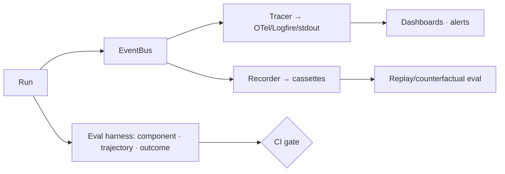

# 11 — Observability & Evaluation

> You can't improve what you can't see. Part of OpenMate; see [architecture.md §16](architecture.md#16-observability--evaluation). The event stream ([01](01-domain-model-and-kernel.md)) is the substrate; tracing projects it onto standards, and evaluation judges whether runs were *good*.

## Scope & responsibilities

This module owns the `Tracer` port (spans/metrics on OpenTelemetry GenAI conventions), the **eval harness** (component, trajectory, outcome, and replay evals), LLM-as-judge scoring, and the record/replay infrastructure that makes both deterministic. Tracing answers *what happened*; evaluation answers *was it good* — the GenAI conventions deliberately stop at attributes/usage/latency, so quality/safety scoring is OpenMate's own layer.

---

## Core abstractions (class level)

```python
# openmate/ports/tracer.py
class Tracer(Protocol):
    def span(self, name: str, kind: "SpanKind", **attrs) -> ContextManager["Span"]: ...
    def record(self, event: Event) -> None: ...
    def metric(self, name: str, value: float, **labels) -> None: ...

SpanKind = Literal["agent","workflow","tool","model","retriever","guardrail"]  # GenAI semconv

# openmate/eval/harness.py
@dataclass
class Case: id: str; input: Input; expected: Any | None = None; rubric: str | None = None
class Evaluator(Protocol):
    async def score(self, case: Case, result: RunResult, trace: "Trace") -> "Score": ...
@dataclass
class Score: name: str; value: float; passed: bool; detail: dict = field(default_factory=dict)
```

---

## Phase 0 — PoC (foundational)

**Goal:** see every run and assert on its outcome.

- **Stdout/JSONL tracer:** subscribe to the `EventBus` and write structured spans/events to console + a JSONL file. Zero infra; immediately useful for debugging the loop.
- **Golden test runner:** a tiny harness that runs an `Agent` over a list of `Case`s against recorded models ([03](03-model-port-and-providers.md) `FakeModel`) and checks an exact/contains/regex assertion.

```python
class JsonlTracer(Tracer):
    def __init__(self, path): self._f = open(path, "a")
    def record(self, ev): self._f.write(codec.to_json(ev) + "\n")
    def span(self, name, kind, **a): return _SpanCtx(self, name, kind, a)  # logs enter/exit + duration

async def run_suite(agent: Agent, cases) -> list[Score]:
    return [assert_case(c, await agent.run(c.input)) for c in cases]   # agent carries its own Services
```

**PoC acceptance:** every run produces a readable trace tree; a small golden suite passes deterministically in CI.

---

## Phase 1 — Structured tracing (OpenTelemetry GenAI)

- **OTel adapter:** emit `agent`/`workflow`/`tool`/`model`/`retriever`/`guardrail` spans with GenAI semantic-convention attributes (model name, token usage, latency) and required metrics. Each step opens a span; each model/tool/retrieval call is a child span — capturing the agent's **decision graph**, not just its I/O boundary.
- **Backends by config:** OTel collector, Logfire, LangSmith, or stdout — all consume the same event stream, so switching never touches app code.
- **Correlation:** `thread_id`/`run_id`/`step` propagate as span attributes so traces, checkpoints, and logs line up.

---

## Phase 2 — Evaluation harness

Measure quality at three granularities (run all in CI as gates):

```python
# component evals
class RetrievalEval(Evaluator): ...     # recall@k, MRR, nDCG (07)
class FaithfulnessEval(Evaluator): ...  # claims supported by cited evidence (07/10)
class ToolArgEval(Evaluator): ...       # did the agent call tools with correct args
# trajectory evals
class TrajectoryEval(Evaluator): ...    # step count, redundant calls, plan adherence, loop incidents
# outcome evals
class RubricJudge(Evaluator):           # LLM-as-judge against a rubric (+ programmatic checks)
    async def score(self, case, result, trace): ...
```

Techniques: **LLM-as-judge** with rubric + few-shot calibration; **pairwise comparison** for A/B of prompts/strategies; **programmatic checks** (exact match, unit tests for code tasks, JSON-schema validity); **dataset management** (versioned case sets, golden traces); **regression gates** (a change that lowers the suite score fails the build).

---

## Phase 3 — Replay, debugging & analysis

- **Record/replay:** `RecordingModel` captures live responses to cassettes; replays drive deterministic tests and **counterfactual evals** ("re-run this trace with a new prompt/model/strategy and diff outcomes") — enabled by determinism (architecture P8).
- **Time-travel debugging:** reconstruct `RunState` at any event ([01](01-domain-model-and-kernel.md) Phase 2) and fork a run from there to test a fix.
- **Trace diffing:** compare two trajectories (baseline vs. candidate) to localize a regression.
- **Failure clustering:** group failing cases by signature (tool error, loop, ungrounded) to prioritize fixes.

---

## Phase 4 — Production monitoring & continuous eval

- **Live dashboards & metrics:** success rate, p50/p95 latency, $/run, tokens/run, tool error rate, guardrail trigger rate, loop incidents.
- **Online eval / sampling:** score a sample of production runs with judges; alert on quality/cost/safety drift.
- **Cost & latency attribution:** per-agent/per-tool/per-model breakdown from spans → drives routing ([03](03-model-port-and-providers.md)) and budget tuning ([12](12-production-and-reliability.md)).
- **Trajectory mining:** harvest successful runs into procedural memory / few-shot exemplars ([06](06-memory-and-state.md), [05](05-planning-and-reasoning.md)).
- **Red-team in CI:** the injection/jailbreak suite ([10](10-safety-and-guardrails.md)) runs as a gate.



## Testing & verification

- **Tracer fidelity:** span tree matches the event log; OTel attributes conform to the GenAI semconv.
- **Judge calibration:** LLM-judge agreement with human labels measured on a calibration set; track drift.
- **Determinism:** replay of a cassette reproduces the recorded trace exactly.
- **Gate correctness:** an intentionally worse prompt fails the regression gate.

## Trade-offs & open questions

LLM-judge cost/variance vs. programmatic checks (prefer programmatic where possible; judge for open-ended). How much content to capture in spans (privacy vs. debuggability — redact per [10](10-safety-and-guardrails.md)). Online eval sampling rate (cost vs. coverage). Owning dashboards vs. leaning on a vendor (lean vendor via OTel).
