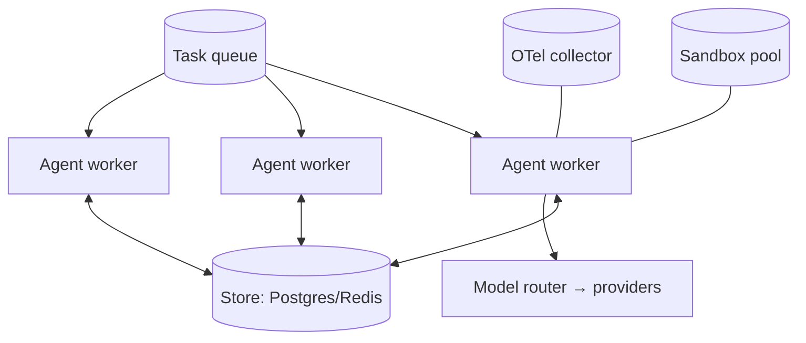

# 12 — Production & Reliability

> The infrastructure around the model — where production agents actually live. Part of OpenMate; see [architecture.md §17](architecture.md#17-production-concerns). The model is a small fraction of a production agent; this module is most of the rest.

## Scope & responsibilities

This module covers durability/durable execution, concurrency and horizontal scaling, cost/latency control, reliability (retries, fallback, idempotency), rate limiting/quotas, versioning/reproducibility, secrets/security, and deployment shape. It composes pieces defined elsewhere — `Store` ([06](06-memory-and-state.md)), `RouterModel` ([03](03-model-port-and-providers.md)), guardrail budgets ([10](10-safety-and-guardrails.md)), tracing ([11](11-observability-and-evaluation.md)) — into an operable system.

---

## Core abstractions (class level)

```python
# openmate/prod/budget.py
@dataclass
class Budget:
    max_steps: int | None = None; max_tokens: int | None = None
    max_usd: float | None = None; max_wall_s: float | None = None
    def charge(self, usage: Usage) -> "Budget": ...        # decrement; raises BudgetExceeded
# openmate/prod/reliability.py
class RetryPolicy:    async def run(self, fn, *, retries=3, base=0.5, jitter=True): ...
class CircuitBreaker: def trip(self, key): ...; def closed(self, key) -> bool: ...
class RateLimiter:    async def acquire(self, key: str, cost: float = 1.0) -> None: ...  # token bucket
@dataclass
class IdempotencyKey: value: str                            # derived from (thread, step, tool, args)
```

---

## Phase 0 — PoC (foundational)

**Goal:** don't crash, don't loop forever, don't blow the budget — runnable as a single process.

- **Budget enforcement:** `BudgetInterceptor` ([02](02-agent-loop-and-runtime.md)) charges `Usage` each step and stops on exceed (a `StopPolicy`).
- **Step/loop caps + loop guard:** `MaxSteps` + `NoProgress` ([02](02-agent-loop-and-runtime.md)) prevent runaways.
- **Basic retries + timeouts:** wrap model and tool calls in `RetryPolicy` with per-call timeouts.
- **SQLite checkpointing:** state saved each step ([06](06-memory-and-state.md)) so a crash loses at most one step.

**PoC acceptance:** an agent with a $/step ceiling stops cleanly at the limit; killing the process mid-run and restarting resumes from the last checkpoint without redoing completed work.

---

## Phase 1 — Reliability & idempotency

- **Idempotent tools & resume safety:** non-idempotent tools carry an `IdempotencyKey`; before re-executing on resume, the executor checks whether the effect already happened (key seen → skip) so a crash between "tool ran" and "state saved" doesn't double-execute.
- **Retries with backoff + circuit breaking:** transient provider/tool errors retried with jittered exponential backoff; a tripped breaker skips a failing backend ([03](03-model-port-and-providers.md) `RouterModel`).
- **Model fallback:** on rate-limit/outage, fail over to a secondary provider (invisible behind the model port).
- **Graceful degradation:** a failed worker/tool degrades the result (partial answer + note) rather than aborting the whole run ([08](08-multi-agent-orchestration.md)).

---

## Phase 2 — Concurrency & horizontal scale

Stateless workers + external state = scale by adding workers.



- **Stateless agent workers:** each loads `RunState` from the `Store`, processes, checkpoints — so any worker can pick up any thread.
- **Optimistic concurrency:** compare-and-swap on `rev` prevents two workers clobbering a thread; reducers merge legitimate concurrent updates ([01](01-domain-model-and-kernel.md)).
- **Queue-driven execution:** durable queue (Redis/SQS/NATS) for fan-out, retries, and backpressure; long runs resume via checkpoints rather than holding a worker.
- **Async concurrency:** many threads cooperate on one event loop; sandboxes/tools run in a pool.

---

## Phase 3 — Durable execution

**Checkpointing ≠ durable execution.** Naive snapshots can resume into an inconsistent world (a side effect happened but isn't reflected in restored state). Address with:

- **Semantics-aware checkpoints:** record tool-call cursors + idempotency keys so resumed runs don't re-do completed effects ([Phase 1](#phase-1--reliability--idempotency)).
- **Durable-execution backend (optional):** for exactly-once guarantees, run the loop on a workflow engine (Temporal-style) or compile to LangGraph's durable runtime ([13](13-framework-interoperability.md)). The loop's interceptor structure ([02](02-agent-loop-and-runtime.md)) maps onto durable activities.
- **Saga/compensation:** for multi-step side-effecting workflows, define compensating actions so a partial failure can be unwound.

---

## Phase 4 — Cost, performance & operations

- **Cost control:** model routing ([03](03-model-port-and-providers.md)), prompt caching, **semantic response cache** (interceptor), context compaction ([09](09-context-engineering.md)), cheap-executor/strong-planner split ([05](05-planning-and-reasoning.md)). Per-run cost attributed from spans ([11](11-observability-and-evaluation.md)).
- **Latency:** parallel tool dispatch ([04](04-tools-and-mcp.md)), streaming first-token, prefetch/speculation, KV-cache-aware prompt ordering.
- **Rate limiting & quotas:** per-user/per-tool/per-tenant token buckets; fair scheduling; backpressure surfaced as events.
- **Versioning & reproducibility:** prompts, tool specs, agent configs, and strategies are versioned artifacts; traces record which versions ran, so any run is reproducible and a regression is traceable to a change.
- **Secrets & security:** secrets injected at the adapter boundary (never in prompts/state); sandbox blast-radius limits ([04](04-tools-and-mcp.md)); audit log ([10](10-safety-and-guardrails.md)); tenant isolation on stores/memory.
- **Deployment:** stateless agent workers + `Store` + sandboxed tool tier + OTel collector + model router; CLI and HTTP/WS server are thin edges over the same `Agent.run()` loop. Health checks, graceful drain, blue/green or canary by agent version.

---

## Production readiness checklist

| Concern | Mechanism | Doc |
|---|---|---|
| Won't loop forever | `MaxSteps` + `NoProgress` | [02](02-agent-loop-and-runtime.md) |
| Won't overspend | `Budget` interceptor | here |
| Survives crashes | checkpoint + idempotent resume | [06](06-memory-and-state.md), here |
| Scales out | stateless workers + queue + store | here |
| Recovers from provider errors | retries + breaker + fallback | [03](03-model-port-and-providers.md) |
| Safe side effects | sandbox + policy + HITL | [04](04-tools-and-mcp.md), [10](10-safety-and-guardrails.md) |
| Observable | OTel traces + metrics | [11](11-observability-and-evaluation.md) |
| Reproducible | versioned artifacts + recorded traces | [11](11-observability-and-evaluation.md) |

## Testing & verification

- **Chaos/crash tests:** kill workers at random steps; assert no double execution and eventual completion.
- **Load test:** N concurrent threads sustain throughput; CAS prevents state corruption.
- **Failover:** provider outage triggers fallback within SLA; breaker opens/closes correctly.
- **Cost ceiling:** budget stops runs precisely; cost attribution matches provider billing within tolerance.

## Trade-offs & open questions

Checkpoint-based vs. full durable-execution engine (start with semantics-aware checkpoints; adopt Temporal/LangGraph durability only where exactly-once is required). Queue tech choice. How much to cache (staleness vs. savings). Multi-tenancy depth for a personal PoC (design the seams, defer full isolation).
