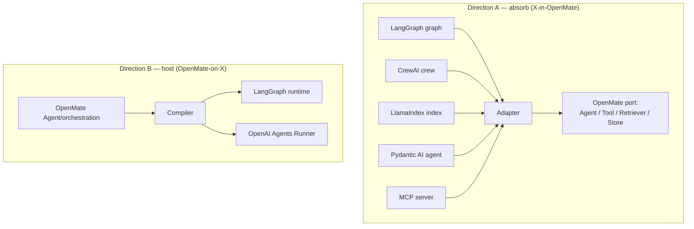

# 13 — Framework Interoperability

> Depend on none, interoperate with all. Part of OpenMate; see [architecture.md §15](architecture.md#15-framework-interoperability). Interop runs in **two directions**: absorb others' components behind OpenMate ports, or host OpenMate on others' runtimes.

## Scope & responsibilities

This module owns the `adapters/frameworks/*` layer that maps OpenMate's vocabulary onto LangGraph, OpenAI Agents SDK, CrewAI, AutoGen/AG2, LlamaIndex, and Pydantic AI — and the Claude/Anthropic SDK as a supported-but-not-required adapter. It defines the two interop directions, the concept mappings, and the compatibility tests that prove components are actually interchangeable. It depends on the ports from every other module; it adds no new kernel concepts.



---

## Core abstractions (class level)

```python
# openmate/adapters/frameworks/base.py
class FrameworkAdapter(Protocol):
    # Direction A — wrap a foreign component as an OpenMate port
    def as_agent(self, foreign: Any) -> Agent: ...
    def as_tool(self, foreign: Any) -> Tool: ...
    def as_retriever(self, foreign: Any) -> Retriever: ...
    # Direction B — emit OpenMate config onto a foreign runtime
    def compile(self, agent: Agent | Orchestrator) -> Any: ...

@dataclass
class InteropReport:                       # what survived the mapping
    supported: list[str]; degraded: list[str]; unsupported: list[str]
```

---

## Phase 0 — PoC (foundational): MCP + tool absorption

**Goal:** the highest-value, lowest-friction interop — consume external tools immediately.

- **MCP client** ([04](04-tools-and-mcp.md)): any MCP server's tools/resources become OpenMate `Tool`s/retrievers. This alone unlocks a huge tool ecosystem with no per-framework work.
- **Single-tool absorption:** wrap a LangChain/LlamaIndex/OpenAI function tool as a `FunctionTool` by adapting its schema + call signature.

```python
def langchain_tool_as_om(t) -> Tool:
    spec = ToolSpec(t.name, t.description, t.args_schema.schema())
    return FunctionTool(lambda **kw: t.invoke(kw), spec)
```

**PoC acceptance:** an OpenMate agent uses a tool that originated in another ecosystem, indistinguishable from a native tool (same scoping, approval, tracing).

---

## Phase 1 — Absorb agents & retrievers (Direction A)

Wrap whole components behind ports:

- **LlamaIndex → `Retriever`:** adapt a `VectorStoreIndex`/query engine to `retrieve()` ([07](07-retrieval-rag.md)).
- **Pydantic AI → `Agent`:** wrap a typed Pydantic AI agent; its validated output maps to a `DataPart`/`ModelResponse`; its tools map to `ToolSpec`s.
- **CrewAI crew → `Agent`/`AgentTool`:** run a crew behind one OpenMate agent ([08](08-multi-agent-orchestration.md)).
- **LangGraph graph → `Agent`:** invoke a compiled graph as a single OpenMate agent, mapping its state I/O to `Message`s.

```python
class CrewAIAdapter(FrameworkAdapter):
    def as_agent(self, crew) -> Agent:
        async def run_crew(task, ctx): return crew.kickoff(inputs=task)   # bridge call
        return Agent(name=crew.name, model=NullModel(), instructions="", tools=[],
                     planner=ExternalRunner(run_crew))   # ExternalRunner short-circuits the loop
```

`ExternalRunner` is a `ReasoningStrategy` that delegates the whole step to the foreign component and returns its result as `Final` — so foreign agents drop into orchestration ([08](08-multi-agent-orchestration.md)) like native ones.

---

## Phase 2 — Host OpenMate on other runtimes (Direction B)

Compile an OpenMate `Agent`/orchestration onto a foreign runtime when you want that runtime's guarantees.

- **Compile to LangGraph:** emit a state graph (assemble → reason → tools → check nodes) to gain LangGraph's durable checkpointing/time-travel ([12](12-production-and-reliability.md)). The interceptor chain ([02](02-agent-loop-and-runtime.md)) maps to nodes; `RunState` maps to graph state with reducers.
- **Run inside OpenAI Agents Runner:** map an OpenMate `Agent` to an SDK `Agent` (tools→function tools, guardrails→SDK guardrails, handoffs→handoffs, store→Sessions), then drive it with the SDK `Runner`.

```python
class LangGraphAdapter(FrameworkAdapter):
    def compile(self, agent) -> "CompiledGraph":
        g = StateGraph(RunStateSchema)
        g.add_node("reason", reason_node(agent)); g.add_node("tools", tool_node(agent))
        g.add_conditional_edges("reason", route, {"tools":"tools","end":END})
        g.add_edge("tools","reason")
        return g.compile(checkpointer=...)            # gain durable execution
```

This is a translation layer (more involved than absorption) and is provided where the runtime's guarantees are worth it.

---

## Phase 3 — Cross-agent protocols & full mapping

- **A2A (agent-to-agent):** consume/expose agents across systems; remote agents appear as `AgentTool`s ([08](08-multi-agent-orchestration.md)).
- **Expose-as-MCP-server:** publish OpenMate tools/agents so other ecosystems consume them ([04](04-tools-and-mcp.md)) — the symmetric half of Phase 0.
- **Tracing interop:** since everything is OTel ([11](11-observability-and-evaluation.md)), OpenMate traces interleave with LangSmith/Logfire/foreign traces.

### Concept mapping (the contract that keeps adapters small)

| OpenMate | LangGraph | OpenAI Agents SDK | CrewAI | AutoGen/AG2 | LlamaIndex | Pydantic AI |
|---|---|---|---|---|---|---|
| `Agent.run()` (loop) | Pregel runtime | `Runner` | `Crew.kickoff()` | `GroupChatManager` | `Workflow` | `Agent.run()` |
| `Agent` | node/subgraph | `Agent` | `Agent` | `ConversableAgent` | `FunctionAgent` | `Agent` |
| `ReasoningStrategy` | graph wiring | implicit loop | process type | chat pattern | workflow steps | implicit |
| `Tool` | tool node | function tool | tool | registered fn | `FunctionTool` | tool |
| `Orchestrator` | edges/`Command` | handoffs | `Process` | `GroupChat` | `AgentWorkflow` | graph |
| `Store` | checkpointer | `Sessions` | memory | — | `Context` | durable exec |
| `Guardrail` | custom node | `Guardrails` | custom | custom | — | output validators / HITL |
| `Model` | chat model | model (Responses) | LLM | model client | LLM | `Model` |
| `Retriever` | custom | file/vector tools | knowledge | — | native index | tools |
| `Tracer` | LangSmith | built-in | events | — | callbacks | Logfire/OTel |

---

## Phase 4 — The Claude SDK stance & extensibility

- **Claude/Anthropic SDK:** a first-class `Model` adapter and tool/MCP source; Anthropic-specific features (prompt caching, extended thinking, memory tool, MCP) exposed via capability flags — **supported, never depended on**. An Anthropic-backed OpenMate is fully featured; swapping providers stays a config change.
- **Adapter SDK:** document the minimal surface to add a new framework adapter (implement `FrameworkAdapter`, pass the compatibility suite) so the system stays extensible to "self-invented components" and future frameworks.
- **Self-invented components:** because every integration point is a port, a hand-rolled planner, retriever, or orchestrator sits beside framework adapters with equal standing — the original goal of understanding agents deeply enough that no framework is load-bearing.

## Testing & verification

- **Interchangeability suite:** the same task passes with a native vs. absorbed component (e.g., native retriever vs. LlamaIndex retriever) — proving the port boundary holds.
- **Round-trip:** compile an agent to LangGraph, run it, and assert outcome parity with the native runtime on a cassette.
- **Degradation reporting:** `InteropReport` lists what didn't map (e.g., a foreign feature with no OpenMate equivalent) so gaps are explicit.
- **MCP contract:** absorbed MCP tools behave identically to native under scoping/approval/tracing.

## Trade-offs & open questions

Absorption (cheap, common) vs. hosting (costly, occasional) — invest in hosting only for LangGraph durability and SDK-Runner parity. How faithfully foreign features map (accept documented degradation over leaky abstractions). Maintenance cost as foreign APIs churn (pin versions; lean on the compatibility suite to catch breaks).
