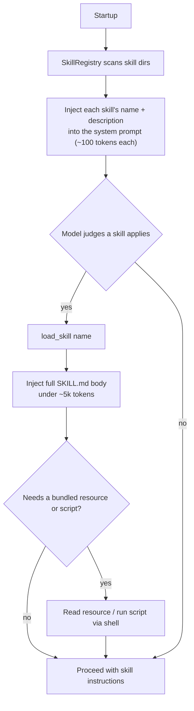

# 14 — Skills (the SKILL.md system)

> Portable, reusable *procedures* an agent loads on demand. Part of OpenMate; see [architecture.md §8](architecture.md#8-tools--capabilities-incl-mcp). Skills are sourced through the `ToolProvider` seam in [04](04-tools-and-mcp.md); this doc owns the SKILL.md format, progressive disclosure, and the skill lifecycle.

## Scope & responsibilities

A **skill** is a directory containing a `SKILL.md` (YAML frontmatter + Markdown instructions) plus optional bundled scripts/resources. It is a *procedure*, not a tool — it tells the agent **how** to do something and **composes** tools (Shell, MCP — [04](04-tools-and-mcp.md)) rather than replacing them. OpenMate adopts the **open SKILL.md standard** verbatim, so skills authored for Claude/Cursor/Codex/etc. load unchanged — interop, not reinvention ([13](13-framework-interoperability.md)).

This module owns the manifest/skill model, the registry + loader (`LoadSkillTool`), the `SkillProvider` (which is a `ToolProvider`, [04](04-tools-and-mcp.md)), **progressive disclosure**, and skill authoring/governance. Selection is **soft** — the model decides when a skill applies from its description, the same mechanism as planning-as-a-tool ([05](05-planning-and-reasoning.md)); there's no router.

---

## Core abstractions (class level)

```python
# openmate/skills/skill.py
@dataclass
class SkillManifest:                      # parsed from SKILL.md YAML frontmatter
    name: str                             # ≤64 chars, [a-z0-9-]; no reserved words
    description: str                      # ≤1024 chars: WHAT it does + WHEN to use (drives selection)
    version: str | None = None
    tools: list[str] = field(default_factory=list)        # tool names the skill may use (least privilege)
    resources: list[str] = field(default_factory=list)    # bundled files, relative paths

@dataclass
class Skill:
    manifest: SkillManifest
    path: Path
    def body(self) -> str: ...            # SKILL.md markdown (loaded lazily — level 2)
    def render(self) -> str: ...          # body + an index of available resources
    def resource(self, rel: str) -> bytes: ...            # level 3, on demand

class SkillRegistry:
    def discover(self, *paths: Path) -> None: ...         # parse frontmatter only (cheap)
    def cards(self) -> list[SkillManifest]: ...           # the ~100-token metadata (level 1)
    def get(self, name: str) -> Skill: ...                # load body on demand

class LoadSkillTool(Tool):                # the tool the model calls to pull a skill's body into context
    spec = ToolSpec(name="load_skill", side_effecting=False,
        description="Load a skill's full instructions when its listed description matches the task. "
                    "Pass the skill name from the available-skills list.",
        parameters=schema_of(name=str))
    def __init__(self, reg: SkillRegistry): self.reg = reg
    async def invoke(self, args, ctx: RunContext) -> ToolResult:
        skill = self.reg.get(args["name"])
        ctx.activate_skill(skill)                          # registers skill.tools into the scoped registry (10)
        return ToolResult([TextPart(skill.render())])      # body enters context (progressive disclosure L2)

class SkillProvider(ToolProvider):        # a ToolProvider (04): yields LoadSkillTool + injects skill cards
    def __init__(self, paths: list[str]): self.reg = SkillRegistry(); self._paths = paths
    async def setup(self): self.reg.discover(*map(Path, self._paths))
    async def tools(self): return [LoadSkillTool(self.reg)]
    def system_fragment(self) -> str:                      # level-1 disclosure: cards in the system prompt
        return "## Available skills\n" + "\n".join(f"- **{c.name}**: {c.description}" for c in self.reg.cards())
```

---

## Progressive disclosure (the defining mechanism)

Skills keep context cheap by revealing themselves in **three levels** — only what's needed, when it's needed:



- **Level 1 — cards (always loaded):** name + description (~100 tokens each) injected into the system prompt via `SkillProvider.system_fragment()`. This is all the model needs to *decide* whether a skill applies.
- **Level 2 — body (on trigger):** `load_skill(name)` returns the full `SKILL.md` instructions (target < ~5k tokens) into context.
- **Level 3 — resources (on demand):** bundled files/scripts read or executed only when the body calls for them.

---

## Phase 0 — PoC (foundational)

**Goal:** discover skills on disk, surface their cards, and load one on request.

Ship: `SkillManifest`/`Skill` (frontmatter parse + lazy body), `SkillRegistry.discover/cards/get`, `LoadSkillTool`, and `SkillProvider`. Wire the provider into an agent via `assemble()` ([02](02-agent-loop-and-runtime.md)); cards appear in the system prompt and `load_skill` injects a body.

**PoC acceptance:** with three skills on disk, the agent loads exactly the relevant one for a task, loads none for an unrelated task, and the loaded body appears in context.

---

## Phase 1 — Bundled resources & scripts (level-3 disclosure)

A skill is more than prose — it can carry reference files and runnable scripts.

- **Resources:** `Skill.render()` appends an index of bundled files; the model reads one via a `read_file`/resource tool only when needed (keeps the body small).
- **Scripts:** a skill bundles a script it runs through the `ShellTool` ([04](04-tools-and-mcp.md)) — e.g., a batch summarizer — so procedures can include deterministic code, not just instructions.

**Worked example — a skill on disk:**

```
skills/email/triage-inbox/
├── SKILL.md          # frontmatter: name: triage-inbox · description: "Sort unread mail into
│                     #   action/waiting/FYI and propose labels. Use when asked to triage or
│                     #   clean up the inbox." + markdown steps
├── rubric.md         # resource: labeling rubric (loaded on demand)
└── scripts/
    └── summarize.py  # resource: run via shell to batch-summarize threads
```

At startup the card is injected (`triage-inbox: Sort unread mail…`); when Alan says "triage my inbox," the model calls `load_skill("triage-inbox")`, the body + rubric enter context, and the skill drives Gmail MCP reads ([04](04-tools-and-mcp.md)) plus an optional `summarize.py` shell run.

---

## Phase 2 — Authoring & the SKILL.md format

- **Format:** YAML frontmatter (`name`, `description` required; `version`, `tools`, `resources` optional) + a Markdown body; bundled assets under the skill directory (`scripts/`, reference docs). OpenMate validates the manifest on `discover()`.
- **Description quality is the product:** because selection is soft, the description must say **what it does and when to use it** — that single string is what makes the model pick the skill. Treat it as prompt surface, not a label.
- **Portability:** the same SKILL.md runs across the 30+ tools that adopted the open standard, and OpenMate can both **consume** third-party skills and **publish** its own ([13](13-framework-interoperability.md)).

---

## Phase 3 — Dynamic selection & scale

- **Card retrieval at scale:** with many skills, injecting every card bloats the system prompt — instead retrieve the top-k relevant cards per turn (RAG over skill cards, [07](07-retrieval-rag.md)/[09](09-context-engineering.md)) rather than listing all.
- **Deactivation:** `load_skill` can be paired with an unload to reclaim context once a skill's body is no longer needed (links to context editing, [09](09-context-engineering.md)).
- **Precedence & namespacing:** resolve name collisions across skill sources; let a user/project skill shadow a default.

---

## Phase 4 — Governance, versioning & trust

- **Least privilege:** a skill's declared `tools` are an allowlist — loading it activates only those tools into the scoped registry ([10](10-safety-and-guardrails.md)), nothing more.
- **Untrusted skills:** a skill from an unknown source is treated as untrusted content — it cannot silently widen tool scope and runs with reduced privilege (prompt-injection defense, [10](10-safety-and-guardrails.md)).
- **Versioning & provenance:** skills are versioned artifacts; traces record which skill/version ran ([11](11-observability-and-evaluation.md), [12](12-production-and-reliability.md)).
- **Evaluation:** skills are eval targets — measure task success with vs. without a skill loaded ([11](11-observability-and-evaluation.md)) so a skill earns its place.
- **Distribution (future):** packaging, signing, and a marketplace for sharing skills across agents/teams.

---

## Testing & verification

- **Disclosure:** cards (level 1) are always present; `load_skill` injects the body (level 2) only when relevant; resources (level 3) load only when read; an unrelated task loads no skill.
- **Interop:** an unmodified third-party `SKILL.md` (Claude/Cursor format) discovers, loads, and runs.
- **Least privilege:** loading a skill activates only its declared `tools`; an untrusted skill cannot escalate scope.
- **Script safety:** a skill-bundled script runs only through the sandboxed `ShellTool` ([04](04-tools-and-mcp.md)).

## Trade-offs & open questions

Skills (soft, model-selected procedures) vs. orchestrated sub-agents ([08](08-multi-agent-orchestration.md)) for complex workflows — skills are lighter and transparent but unstructured. How much to put in a skill **body** vs. **bundled resources** (body bloats context; resources add a load step). When to switch from "inject all cards" to **retrieved** card selection (past ~20–30 skills). Whether `load_skill` should auto-deactivate to reclaim context, and how aggressively. How much to trust third-party skills by default (lean: untrusted until vetted).
